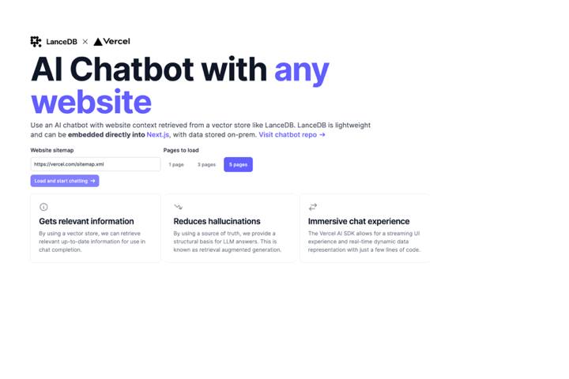
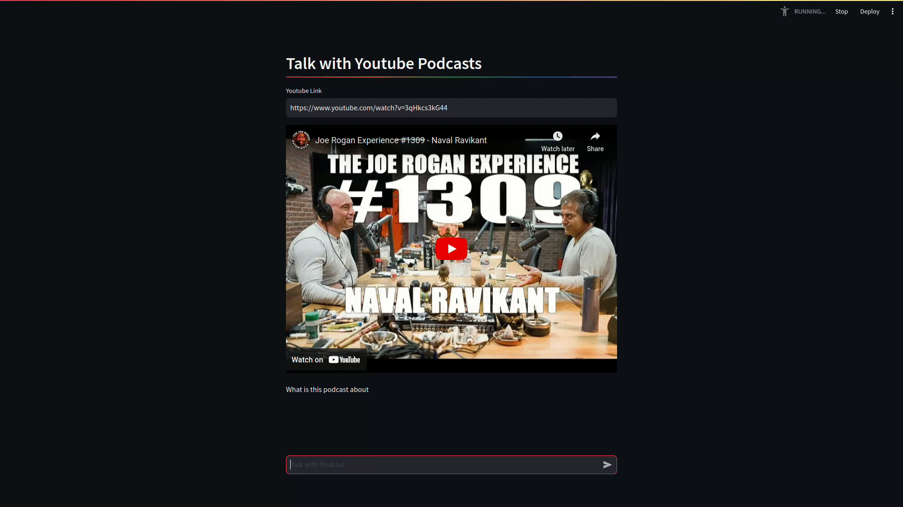
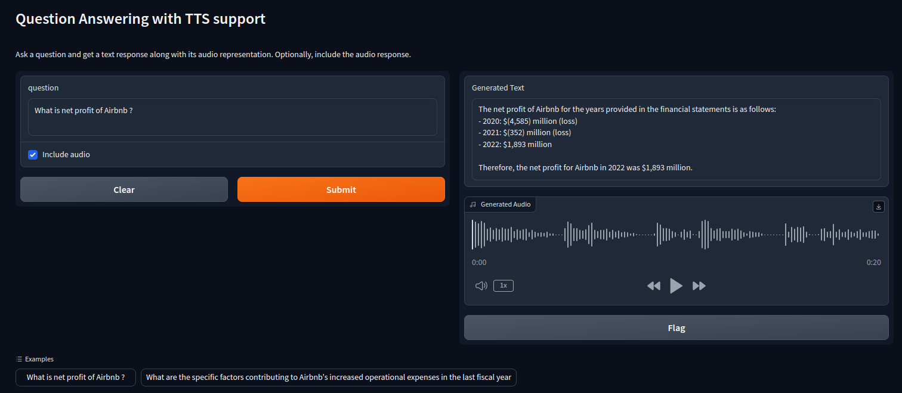
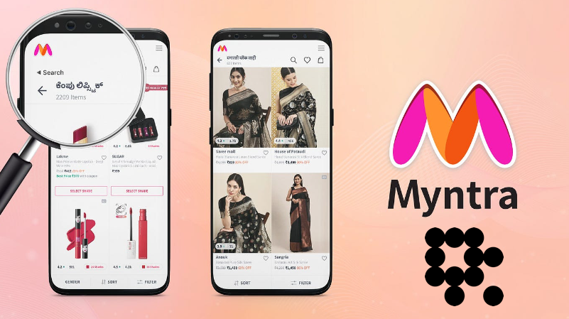
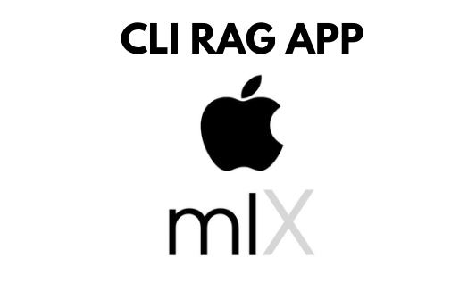
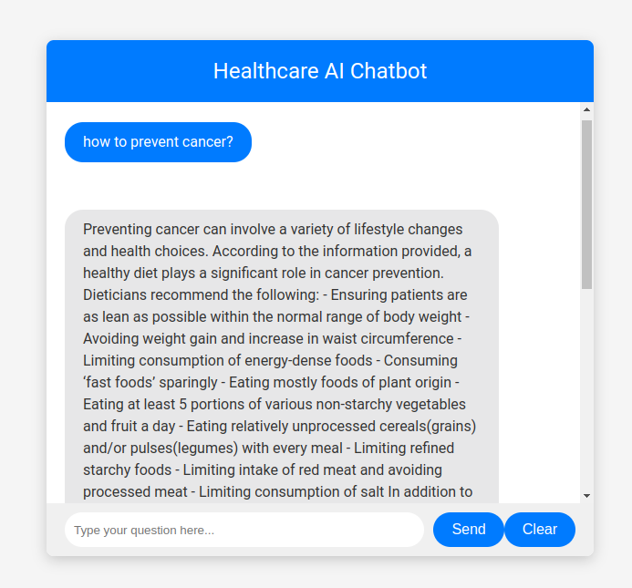

# VectorDB-recipes
 
Dive into building GenAI applications!
This repository contains examples, applications, starter code, & tutorials to help you kickstart your GenAI projects.

- These are built using LanceDB, a free, open-source, serverless vectorDB that **requires no setup**. 
- It **integrates into Python data ecosystem** so you can simply start using these in your existing data pipelines in pandas, arrow, pydantic etc.
- LanceDB has **native Typescript SDK** using which you can **run vector search** in serverless functions!

 
Join our community for support - <a href="https://discord.gg/zMM32dvNtd">Discord</a> •
<a href="https://twitter.com/lancedb">Twitter</a>

---

This repository is divided into 2 sections:
- [Examples](#examples) - Get right into the code with minimal introduction, aimed at getting you from an idea to PoC within minutes!
- [Applications](#projects--applications) - Ready to use Python and web apps using applied LLMs, VectorDB and GenAI tools

The following examples are organized into different tables to make similar types of examples easily accessible.

### Sections

- [Build from Scratch](#build-from-scratch) - Build applications/examples from scratch using LanceDB for efficient vector-based document retrieval.
- [Multimodal](#multimodal) - Build a multimodal search application with input text or image as queries.
- [RAG](#rag) - Build a variety of RAG by loading data from different formats and query with text.
- [Vector Search](#vector-search) - Build vector search application using different search algorithms.
- [Chatbot](#chatbot) - Build chatbot application where user input queries to retrieve relevant context and generate coherent, context-aware replies.
- [Evalution](#evaluation) - Evaluate reference and candidate texts to measure their performance on various metrics.
- [AI Agents](#ai-agents) - Design an application powered with AI agents to exchange information, coordinate tasks, and achieve shared goals effectively.
- [Recommender Systems](#recommender-systems) - Build Recommendation systems which generate personalized recommendations and enhance user experience.
- [Concepts](#concepts) - Concepts related to LLM applications pipeline to ensures accurate information retrieval.

### 🌟 New 🌟 
- Vision Retrieval with ColPali -  
- Social media posts caption generation with Llama3.2-11B-Vision - 

### Build from Scratch

Build applications/examples using LanceDB for efficient vector-based document retrieval.

| Build from Scratch &nbsp; &nbsp;| Interactive Notebook & Scripts &nbsp; | 
|-------- | -------------: |
|||
| [Build RAG from Scratch](./tutorials/RAG-from-Scratch) |   |  |
| [Local RAG from Scratch with Llama3](./tutorials/Local-RAG-from-Scratch) |   |  |
| [Multi-Head RAG from Scratch](./tutorials/Multi-Head-RAG-from-Scratch/) |    |  |
||||

### MultiModal

Create a multimodal search application using LanceDB for efficient vector-based retrieval of text and image data. Input text or image queries to find the most relevant documents and images from your corpus.

| Multimodal &nbsp; &nbsp;| Interactive Notebook & Scripts &nbsp; | Blog |
| --------- | -------------------------- | ----------- |
||||
| [Multimodal CLIP: DiffusionDB](/examples/multimodal_clip_diffusiondb/) |       | |
| [Multimodal CLIP: Youtube videos](/examples/multimodal_video_search/) |       ||
| [Cambrian-1: Vision centric exploration of images](https://www.kaggle.com/code/prasantdixit/cambrian-1-vision-centric-exploration-of-images/) |     | |
| [Social Media Caption Generation using Llama3.2-11B-Vision](./examples/social-media-caption-generation-with-llama3.2/) |      |
| [Efficient Vision retreiver with ColPali & LanceDB](/examples/ColPali-vision-retriever) |      | 
||||

### RAG

Develop a Retrieval-Augmented Generation (RAG) application using LanceDB for efficient vector-based information retrieval. Input text queries to retrieve relevant documents and generate comprehensive answers by combining retrieved information.

| RAG &nbsp; &nbsp;| Interactive Notebook & Scripts | Blog |
| --------- | -------------------------- | ----------- |
||||
| [RAG with Contextual Retrieval and Hybrid search](./examples/Contextual-RAG/) |    ||
| [RAG with Matryoshka Embeddings and LlamaIndex](./tutorials/RAG-with_MatryoshkaEmbed-Llamaindex/) |   ||
| [RAG with IBM Watsonx](./examples/RAG-with-watsonx/) |    ||
| [Improve RAG with Re-ranking](/examples/RAG_Reranking/) |   ||
| [Instruct-Multitask](./examples/instruct-multitask) |       ||
| [Improve RAG with HyDE](/examples/Advance-RAG-with-HyDE/) |      ||
| [Improve RAG with LOTR ](/examples/Advance_RAG_LOTR/) |     ||
| [Advanced RAG: Parent Document Retriever](/examples/parent_document_retriever/) |     ||
| [Corrective RAG with Langgraph](./tutorials/Corrective-RAG-with_Langgraph/) |   | |
| [Contextual-Compression-with-RAG](/examples/Contextual-Compression-with-RAG/) |     | |
| [Improve RAG with FLARE](./examples/better-rag-FLAIR) |    | |
| [Agentic RAG ](/tutorials/Agentic_RAG/) |    |
| [GraphRAG ](/examples/Graphrag/) |   ||
| [GraphRAG with CSV File ](/tutorials/GraphRAG_CSV/) |   ||
||||

### Vector Search

Build a vector search application using LanceDB for efficient vector-based document retrieval. Input text queries to find the most relevant documents from your corpus.

| Vector Search &nbsp; &nbsp;| Interactive Notebook & Scripts &nbsp; | Blog |
| --------- | -------------------------- | ----------- |
||||
| [Inbuilt Hybrid Search](/examples/Inbuilt-Hybrid-Search) |     ||
| [Hybrid search BM25 & lancedb ](./examples/Hybrid_search_bm25_lancedb/) |      ||
| [NER powered Semantic Search](./tutorials/NER-powered-Semantic-Search) |   |  |
| [Vector Arithmetic with LanceDB](./examples/Vector-Arithmetic-with-LanceDB/) |      ||
| [Summarize and Search Reddit Posts](./examples/Reddit-summarization-and-search/) |     |
| [Imagebind demo app](./examples/imagebind_demo/) |   |
| [Search Within Images](/examples/search-within-images-with-sam-and-clip/) |     | |
| [Zero Shot Object Detection with CLIP](./examples/zero-shot-object-detection-CLIP/) |  |
| [Vector Search with TransformersJS](./examples/js-transformers/) |  |  |
| [Accelerate Vector Search Applications Using OpenVINO](/examples/Accelerate-Vector-Search-Applications-Using-OpenVINO/) |   | |
||||

### Chatbot

Create a chatbot application using LanceDB for efficient vector-based response generation. Input user queries to retrieve relevant context and generate coherent, context-aware replies.

| Chatbot &nbsp; &nbsp;| Interactive Notebook & Scripts &nbsp; | Blog &nbsp;|
| --------- | -------------------------- | ----------- |
||||
| [Databricks DBRX Website Bot](./examples/databricks_DBRX_website_bot/) |      |
| [CLI-based SDK Manual Chatbot with Phidata](/examples/CLI-SDK-Manual-Chatbot-Locally/) |   |
| [Youtube transcript search bot](/examples/Youtube-Search-QA-Bot/) |      ||
| [Langchain: Code Docs QA bot](/examples/Code-Documentation-QA-Bot/) |     ||
| [Context-Aware Chatbot using Llama 2 & LanceDB](./tutorials/chatbot_using_Llama2_&_lanceDB) |   |  |
||||

### Evaluation

Develop an evaluation application. Input reference and candidate texts to measure their performance on various metrics.

| Evaluation &nbsp; &nbsp;| Interactive Notebook & Scripts &nbsp; | Blog |
| --------- | -------------------------- | ----------- |
||||
| [Evaluating Prompts with Prompttools](/examples/prompttools-eval-prompts/) |      |  |
| [Evaluating RAG with RAGAs](./examples/Evaluating_RAG_with_RAGAs/) |     |  |
||||

### AI Agents

Design an AI agents coordination application with LanceDB for efficient vector-based communication and collaboration. Input queries to enable AI agents to exchange information, coordinate tasks, and achieve shared goals effectively.

| AI Agents &nbsp; &nbsp;| Interactive Notebook & Scripts &nbsp; | Blog |
| --------- | -------------------------- | ----------- |
||||
| [AI email assistant with Composio](/examples/AI-Email-Assistant-with-Composio/) |     |
| [AI Trends Searcher with CrewAI](./examples/AI-Trends-with-CrewAI/) |      ||
| [SuperAgent Autogen](/examples/SuperAgent_Autogen) |  ||
| [AI Agents: Reducing Hallucination](/examples/reducing_hallucinations_ai_agents/) |      ||
| [Multi Document Agentic RAG](./examples/multi-document-agentic-rag/) |       ||
||||

### Recommender Systems

Create a recommender system application with LanceDB for efficient vector-based item recommendation. Input user preferences or item features to generate personalized recommendations and enhance user experience.

| Recommender Systems | Interactive Notebook & Scripts &nbsp; | Blog |
| --------- | -------------------------- | ----------- |
||||
| [Movie Recommender](/examples/movie-recommender/) |   |  |
| [Product Recommender](./examples/product-recommender/) |   | |
| [Arxiv paper recommender](/examples/arxiv-recommender) |     |  |
| [Music Recommender](/applications/Music_Recommandation/) |  | |||||
||||

### Concepts

Checkout concepts of LLM applications pipeline to ensures accurate information retrieval.

| Concepts | Interactive Notebook | Blog |
| --------- | -------------------------- | ----------- |
|           |                            |             |
| [A Primer on Text Chunking and its Types](./tutorials/different-types-text-chunking-in-RAG) |  |  |
| [Langchain LlamaIndex Chunking](./tutorials/Langchain-LlamaIndex-Chunking) |  |  |
| [Create structured dataset using Instructor](./tutorials/NER-dataset-with-Instructor/) |  | |
| [Comparing Cohere Rerankers with LanceDB](./tutorials/cohere-reranker) | |  |
| [Product Quantization: Compress High Dimensional Vectors](https://blog.lancedb.com/benchmarking-lancedb-92b01032874a-2/) | |  |
| [LLMs, RAG, & the missing storage layer for AI](https://blog.lancedb.com/llms-rag-the-missing-storage-layer-for-ai-28ded35fa984) | |  |
| [Fine-Tuning LLM using PEFT & QLoRA](./tutorials/fine-tuning_LLM_with_PEFT_QLoRA) |   |  |
| [Extracting Complex tables-text from PDFs using LlamaParse  ](./tutorials/Advace_RAG_LlamaParser) |    |  |
||||

## Projects & Applications
These are ready to use applications built using LanceDB serverless vector database. You can explore these open source projects, use parts of them in your projects or build your applications on top of these. 

### Node applications powered by LanceDB
| Project Name                                        | Description                                                                                                          | Screenshot                                |
|-----------------------------------------------------|----------------------------------------------------------------------------------------------------------------------|-------------------------------------------|
| [Writing assistant](https://github.com/lancedb/vectordb-recipes/tree/main/applications/node/lanchain_writing_assistant) | Writing assistant app using lanchain.js with LanceDB, allows you to get real time relevant suggestions and facts based on you written text to help you with your writing.                  |  |

| Project Name                                        | Description                                                                                                          | Screenshot                                |
|-----------------------------------------------------|----------------------------------------------------------------------------------------------------------------------|-------------------------------------------|
| [YOLOExplorer](https://github.com/lancedb/yoloexplorer) | Iterate on your YOLO / CV datasets using SQL, Vector semantic search, and more within seconds                  |  |
| [Website Chatbot (Deployable Vercel Template)](https://github.com/lancedb/lancedb-vercel-chatbot) | Create a chatbot from the sitemap of any website/docs of your choice. Built using vectorDB serverless native javascript package. |     |
| [ Chat with multiple  URL/website  ](https://github.com/lancedb/vectordb-recipes/tree/main/applications/chat_with_anywebsite/) | Conversational AI for Any Website with Mistral,Bge Embedding & LanceDB |  |
| [ Talk with Podcast ](https://github.com/lancedb/vectordb-recipes/tree/main/applications/talk-with-podcast) | Talk with Youtube Podcast using Ollama and insanely-fast-whisper | |
| [ Hr chatbot  ](https://github.com/lancedb/vectordb-recipes/tree/main/applications/HR_chatbot/) | Hr chatbot - ask your personal query using zero-shot React agent & tools ||
| [Advanced Chatbot with Parler TTS ](https://github.com/lancedb/vectordb-recipes/tree/main/applications/Chatbot_with_Parler_TTS) | This Chatbot app uses Lancedb Hybrid search, FTS & reranker method with Parlers TTS library.||
| [Multi-Modal Search Engine](https://github.com/lancedb/vectordb-recipes/tree/rf/applications/multimodal-search) | Create a Multi-modal search engine app, to search images using both images or text | |
| [Multimodal Myntra Fashion Search Engine](https://github.com/ishandutta0098/lancedb-multimodal-myntra-fashion-search-engine) | This app uses OpenAI's CLIP to make a search engine that can understand and deal with both written words and pictures.||
| [Multilingual-RAG](https://github.com/lancedb/vectordb-recipes/tree/main/applications/Multilingual_RAG/) | Multilingual RAG with cohere embedding & support 100+ languages||
| [ GTE MLX RAG ](https://github.com/lancedb/vectordb-recipes/tree/main/applications/GTE_mlx_RAG) | mlx based RAG model using lancedb api support | |
| [ Healthcare Chatbot  ](https://github.com/lancedb/vectordb-recipes/tree/main/applications/Healthcare_chatbot/) | Healthcare chatbot using domain specific LLM  & Embedding model | |
||||

**🌟 New! 🌟 Applied GenAI and VectorDB course on Udacity**
Learn about GenAI and vectorDBs using LanceDB in the recently launched [Udacity Course](https://www.udacity.com/course/building-generative-ai-solutions-with-vector-databases--cd12952)

## Contributing Examples
If you're working on some cool applications that you'd like to add to this repo, please open a PR!
