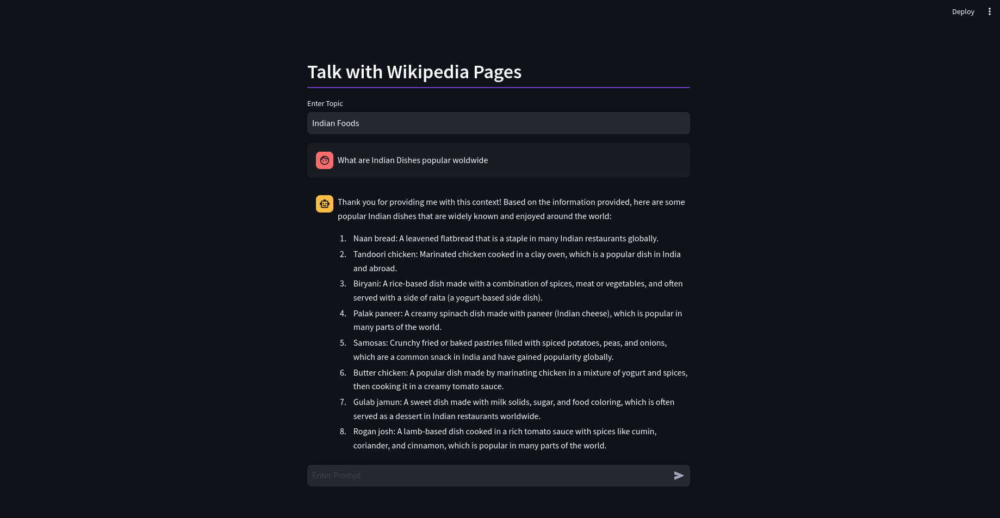
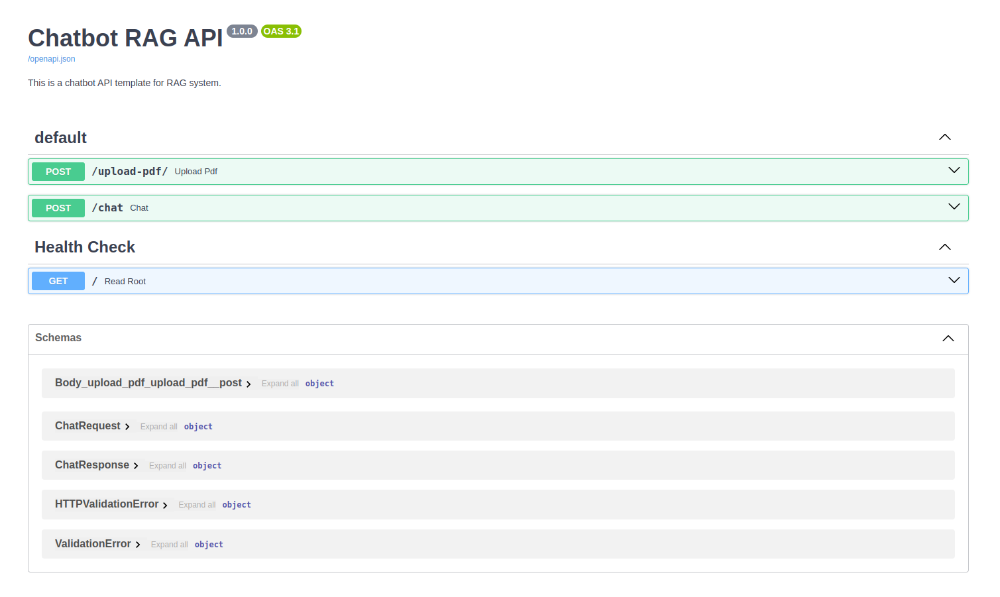

# VectorDB-recipes
 
Dive into building GenAI applications!
This repository contains examples, applications, starter code, & tutorials to help you kickstart your GenAI projects.

- These are built using LanceDB, a free, open-source, serverless vectorDB that **requires no setup**. 
- It **integrates into python data ecosystem** so you can simply start using these in your existing data pipelines in pandas, arrow, pydantic etc.
- LanceDB has **native Typescript SDK** using which you can **run vector search** in serverless functions!

 
Join our community for support - <a href="https://discord.gg/zMM32dvNtd">Discord</a> •
<a href="https://twitter.com/lancedb">Twitter</a>

---

This repository is divided into 3 sections:
- [Examples](#examples) - Get right into the code with minimal introduction, aimed at getting you from an idea to PoC within minutes!
- [Applications](#projects--applications) - Ready to use Python and web apps using applied LLMs, VectorDB and GenAI tools
- [Tutorials](#tutorials) - A curated list of tutorials, blogs, Colabs and courses to get you started with GenAI in greater depth. 

## Examples
Applied examples that get right into the code with minimal introduction, aimed at getting you from an idea to PoC within minutes!
Examples are available as:
* **Colab notebooks** - that builds the application is stages allowing you to investigate results at every intermediate stage.
* **Python scripts** - for cases where you'd like directly to use the file or snippets to integrate in your application
* **JS/TS scripts** - Some examples are written using lancedb's native js library! These script/snippets can also be directly integrated in your web applications.

If you're looking for in-depth tutorial-like examples, checkout the [tutorials](#tutorials) section!

| Example &nbsp; | Notebook & Scripts &nbsp; | Read The Blog!&nbsp; &nbsp; &nbsp; &nbsp;|
|-------- | ------------- | -------------   |
| | | |
| [Youtube transcript search bot](/examples/Youtube-Search-QA-Bot/) |   ||
| [Langchain: Code Docs QA bot](/examples/Code-Documentation-QA-Bot/) | ||
| [AI Agents: Reducing Hallucination](/examples/reducing_hallucinations_ai_agents/) |   | |
| [Multimodal CLIP: DiffusionDB](/examples/multimodal_clip/) | | |
| [Multimodal CLIP: Youtube videos](/examples/multimodal_video_search/) |   ||
| [Multimodal Image + Text Search](/examples/multimodal_search/) |  |  |
| [TransformersJS Embedding example](./examples/js-transformers/) | |  |
| [Movie Recommender](/examples/movie-recommender/) | |  |
| [Product Recommender](./examples/product-recommender/) |    | |
| [Audio Search](./examples/audio_search/) |   | |
| [Arxiv paper recommender](/examples/arxiv-recommender) |   |  |
| [Multi-lingual search](/examples/multi-lingual-wiki-qa) |    | |
| [Instruct-Multitask](./examples/instruct-multitask) |    | |
| [Improve RAG with Re-ranking](/examples/RAG_re_ranking/) |  ||
| [Improve RAG with FLARE](/examples/Advanced-RAG-with-FLARE) |    | |
| [Improve RAG with HyDE](/examples/Advance-RAG-with-HyDE/) |  ||
| [Improve RAG with LOTR ](/examples/Advance_RAG_LOTR/) |  ||
| [Advanced RAG: Parent Document Retriever](/examples/parent_document_retriever/) |  ||
| [RAG Fusion](/examples/RAG_Fusion/) | |
| [Hybrid search BM25 & lancedb ](./examples/Hybrid_search_bm25_lancedb/) |  ||
| [Evaluating Prompts with Prompttools](/examples/prompttools-eval-prompts/) |  |  |
| [NER powered with Semantic Search](/tutorials/NER-powered-Semantic-Search/) |  | |
[Sentiment Analysis : Analysing Hotel Reviews](/examples/Sentiment-Analysis-Analyse-Hotel-Reviews/) |  | |
| [Facial Recognition](./examples/facial_recognition) |  | 
| [Accelerate Vector Search Applications Using OpenVINO](/tutorials/Accelerate-Vector-Search-Applications-Using-OpenVINO/) |  | |
| [Search Within Images](/examples/Contextual-Compression-with-RAG/) |  ||
| [Contextual-Compression-with-RAG](/examples/Contextual-Compression-with-RAG/) |  |

## Projects & Applications
These are ready to use applications built using LanceDB serverless vector database. You can explore these open source projects, use parts of them in your projects or build your applications on top of these. 

| Project Name                                        | Description                                                                                                          | Screenshot                                |
|-----------------------------------------------------|----------------------------------------------------------------------------------------------------------------------|-------------------------------------------|
| [YOLOExplorer](https://github.com/lancedb/yoloexplorer) | Iterate on your YOLO / CV datasets using SQL, Vector semantic search, and more within seconds                  |  |
| [Website Chatbot (Deployable Vercel Template)](https://github.com/lancedb/lancedb-vercel-chatbot) | Create a chatbot from the sitemap of any website/docs of your choice. Built using vectorDB serverless native javascript package. |     |
| [Multi-Modal Search Engine](https://github.com/lancedb/vectordb-recipes/tree/rf/applications/multimodal-search) | Create a Multi-modal search engine app, to search images using both images or text | |
| [ Chat with multiple  URL/website  ](https://github.com/lancedb/vectordb-recipes/tree/main/applications/chat_with_anywebsite/) | Conversational AI for Any Website with Mistral,Bge Embedding & LanceDB |  |
| [ Hr chatbot  ](https://github.com/lancedb/vectordb-recipes/tree/main/applications/HR_chatbot/) | Hr chatbot - ask your personal query using zero-shot React agent & tools ||
| [ Talk with Youtube Video using GPT4 Vision API ](https://github.com/lancedb/vectordb-recipes/tree/main/applications/talk-with-youtube-gpt4-vision-api/) | Talk with Youtube Video using GPT4 Vision API and Langchain | |
| [ Talk with Podcast ](https://github.com/lancedb/vectordb-recipes/tree/main/applications/talk-with-podcast) | Talk with Youtube Podcast using Ollama and insanely-fast-whisper | |
| [ Talk with Wikipedia ](https://github.com/lancedb/vectordb-recipes/tree/main/applications/talk-with-wikipedia) | Talk with Wikipedia Pages | |
| [ Document Chat with Langroid ](https://github.com/lancedb/vectordb-recipes/tree/main/applications/docchat-with-langroid) | Talk with your Documents using Langroid | |
| [ Fastapi RAG template  ](https://github.com/lancedb/vectordb-recipes/tree/main/applications/Chatbot_RAG_with_FASTAPI) | FastAPI based RAG template with Websocket support | |
| [ GTE MLX RAG ](https://github.com/lancedb/vectordb-recipes/tree/main/applications/GTE_mlx_RAG/CLI_example.ipynb) | mlx based RAG model using lancedb api support | |

## Tutorials
Looking to get started with LLMs, vectorDBs, and the world of Generative AI? These in-depth tutorials and courses cover these concepts with practical follow along colabs where possible.
| Tutorial | Interactive Environment | Blog Link |
| --------- | -------------------------- | ----------- |
|           |                            |             |
| [Product Quantization: Compress High Dimensional Vectors](https://blog.lancedb.com/product-quantization-compress-high-dimensional-vectors-dfcba98fab47) | |  |
| [LLMs, RAG, & the missing storage layer for AI](https://medium.com/etoai/llms-rag-the-missing-storage-layer-for-ai-28ded35fa984) | |  |
| [Fine-Tuning LLM using PEFT & QLoRA](./tutorials/fine-tuning_LLM_with_PEFT_QLoRA) |  |  |
| [Context-Aware Chatbot using Llama 2 & LanceDB](./tutorials/chatbot_using_Llama2_&_lanceDB) |  |  |
| [A Primer on Text Chunking and its Types](./tutorials/different-types-text-chunking-in-RAG) |  |  |
| [NER powered Semantic Search](./tutorials/NER-powered-Semantic-Search) |  |  |
| [Better RAG with FLARE](./tutorials/better-rag-FLAIR) |  | |
| [Accelerate Vector Search Applications Using OpenVINO](./tutorials/Sentiment-Analysis-using-LanceDB) |  | |

**🌟 New! 🌟 Applied GenAI and VectorDB course on Udacity**
Learn about GenAI and vectorDBs using LanceDB in the recently launched [Udacity Course](https://www.udacity.com/course/building-generative-ai-solutions-with-vector-databases--cd12952)

## Contributing Examples
If you're working on some cool applications that you'd like to add to this repo, please open a PR!
