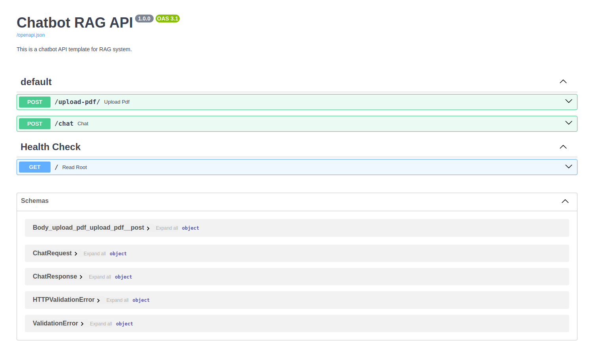

## Chatbot API using FastAPI and WebSocket
It is designed to provide users with quick and accurate responses to their queries through a convenient interface accessible via Swagger FastAPI.

## Features
FastAPI Backend: Utilizes FastAPI for handling backend logic and API responses.

WebSocket Integration: Offers real-time communication between the client and server.

Swagger UI: Easy testing and interaction with the chatbot through the FastAPI's built-in Swagger UI.


###  WebSocket
WebSocket is used in this project for its ability to facilitate real-time,
two-way interaction between the user and the server. This is essential for a chatbot application where immediate response and dynamic conversation flow are crucial.

## Installation
```
pip install -r requirements.txt
```
## run code 
```
uvicorn main:app --reload
```
The --reload flag enables auto-reload so the server will restart upon file changes.

## Usage

1. Once the server is running, navigate to http://localhost:8000/docs to interact with the chatbot using Swagger UI.
2. Upload the pdf
3. Ask the quetions based on your pdf




