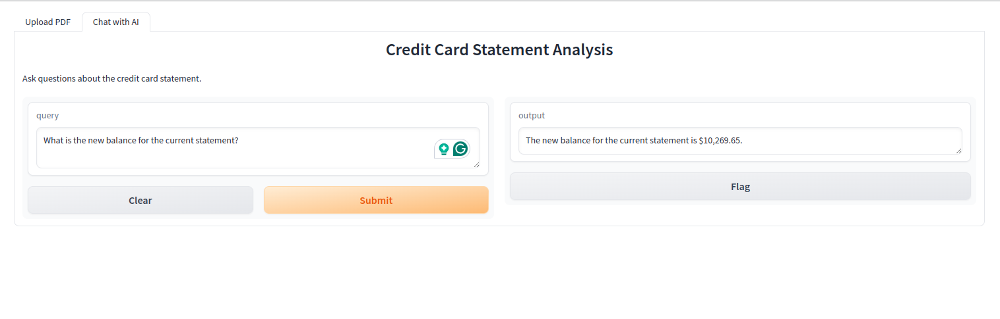

# Credit Card Statement Analysis with AI Chatbot
This project uses AI to analyze credit card statements. By uploading a PDF file, the AI converts it to Markdown format, splits it into chunks, and allows you to ask questions about the statement. The project uses various libraries like Gradio, LangChain, and PyMuPDF4LLM to achieve this functionality.


# Features
- PDF to Markdown Conversion: Converts complex PDFs to Markdown for better understanding by LLMs.
- Chunk Splitting: Splits the document into manageable chunks for efficient processing.
- Question Answering: Uses AI to answer questions about the credit card statement based on the provided context


## Install  libraries
```
pip install langchain openai
pip install -qU langchain-text-splitters
pip install pypdf
pip install langchain_community
pip install pymupdf
pip install lancedb
pip install pymupdf4llm
pip install "unstructured[md]"
pip install -U langchain-openai langchain-community
pip install gradio
pip install tantivy
pip install python-dotenv
```

To integrate the API key securely using environment variables, you can modify your code to read the API key from environment variables instead of hardcoding it. Here’s the updated code with best practices for handling the API key:

Set up environment variables:

Create a .env file in your project directory with the following content:

```
OPENAI_API_KEY=your_openai_api_key_here
```


Make sure your PDF file (sample_credit_card.pdf) is accessible at the specified path.
Open a terminal or command prompt in the directory where the script is saved and run:

# Running the gradio app
```
python main.py
```
Also you can run  gradio app on collab as well

[](https://colab.research.google.com/github/lancedb/vectordb-recipes/blob/main/application/chatbot_with_memory/main.ipynb)


