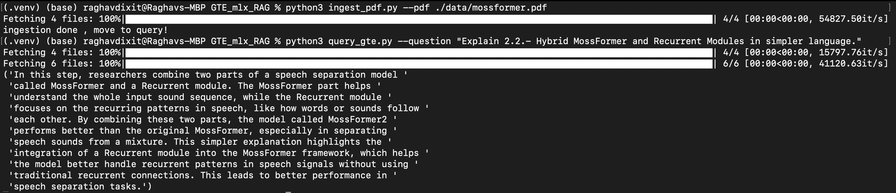

## CLI RAG application using GTE MLX (Apple silicon) and Lancedb
This is a Command Line Interface app designed to provide users with quick and accurate responses to their queries based on the input file (pdf) via RAG architecture.

## Overview
It is built using `lancedb.embeddings.gte` embedding function which uses General Text Embeddings (GTE) model to embed documents, we have added support for Apple silicon devices by adding the MLX format of the model which can be accessed by the 'mlx=True' argument in the function. This app uses `mlx_lm` as the LLM for generating the final response.

- ingest_pdf.py - Extracts text from input pdf and stores in vectorDB.
- query_gte.py - Retrieves context relevent to question from vectorDB and augments prompt to generate RAG response.


## Getting started

* Install requirements

Please install lancedb via git instead of PyPI as some latest features might be missing, to get the latest code, run the following in your virtual env :
```bash
pip install -e "git+https://github.com/lancedb/lancedb.git#egg=lancedb&subdirectory=python" 

python3 -m pip install -r requirements.txt
```

* Create vectors from a pdf file and store in lancedb

Store your input data in './data/' folder and run the following to ingest the vectors :
```bash
python3 ingest_pdf.py --pdf ./data/mossformer.pdf
```

* Query database and generate response

Run the following command by adding your query after the '--question' argument to get the response from the llm
```bash
python3 query_gte.py --question "Explain 2.2.- Hybrid MossFormer and Recurrent Modules in simpler language."
```


## Sample response 


