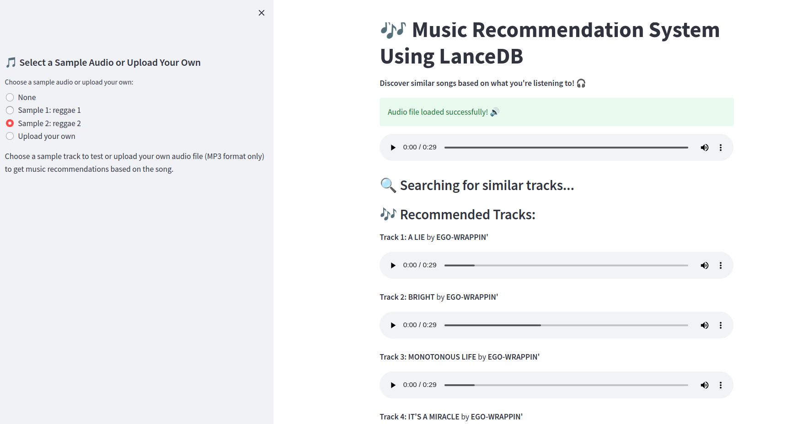

# 🎶 Music Recommendation System using LanceDB




This project implements a music recommendation system using audio feature extraction and vector similarity search. By utilizing **LanceDB**, **PANNs** for audio tagging, and **Librosa** for audio feature extraction, the system finds and recommends tracks with similar audio characteristics based on a query song.

## 📝 Project Overview

The **Music Recommendation System** allows users to:
- Upload their own audio files (in MP3 format) or choose from pre-defined sample tracks.
- Extract audio embeddings using a **pretrained audio tagging model** (PANNs).
- Perform a vector similarity search to find similar tracks based on extracted audio features.
- Play back both the query track and the recommended tracks.

## 🚀 Key Features

- **Audio Embedding Extraction**: Extracts audio embeddings using **PANNs (Pretrained Audio Neural Networks)**.
- **Vector Similarity Search**: Utilizes **LanceDB** for fast vector similarity searches to recommend songs based on their audio embeddings.
- **Interactive UI**: Built using **Streamlit**, offering an intuitive interface to upload or select audio files and view recommendations.
- **Supports Various Genres**: Works with a dataset containing songs from multiple genres.

## 📦 Installation

To set up the project, follow these steps:

1. **Clone the Repository**:
   ```bash
   git clone https://github.com/lancedb/vectordb-recipes
   cd applications/Music_Recommandation
   ```

2. **Install Required Dependencies**:
   Install all required libraries using the following command:
   ```bash
   pip install -r requirements.txt
   ```

3. **Set up the Pretrained Model**:
   The pretrained PANNs model is used to extract audio embeddings. You can either:
   - Download the checkpoint automatically (handled by the app).
   - Or manually place the `Cnn14_mAP=0.431.pth` checkpoint in the `panns_data` folder.

   You can also download the model checkpoint manually from [this link](https://drive.google.com/file/d/1WLvGG9Brz7EOztisuAvwOTTIPjg6RRFr/view?usp=sharing).

## 🎵 Dataset

The **Ludwig Music Dataset** is a compact Music Information Retrieval (MIR) dataset, sourced from **Discogs** and **AcousticBrainZ**, specifically created to support the Ludwig Backend of the **SpotMyFM** music recommendation engine.

### Dataset Overview

- **MP3 Files**: Each track is represented by a 30-second fragment, with filenames corresponding to their respective Spotify Track ID. These fragments have been extracted from Spotify and organized by genre.
- **MFCCs**: Contains `.npy` files for each track, with **Mel-frequency Cepstral Coefficients (MFCCs)**. Each `.npy` file holds approximately 10 MFCCs, with each segment lasting 3 seconds.
- **Spectrograms**: `.npy` files contain **Mel-frequency Spectrograms** for each track. Each `.npy` file includes about 10 spectrogram segments, each 3 seconds in duration.
- **Labels Metadata**: The `labels.json` file includes rich metadata for each track, such as genre, subgenre, and mood.
- **Subgenres Metadata**: The `subgenres.json` file contains a balanced subset of track IDs associated with each subgenre.

### Folder Structure
The dataset is organized as follows:

```sh
../data/ludwig_music_data
├── mfccs
│   ├── reggae/xzxx.npy
│   └── ... (additional tracks by genre)
├── mp3
│   ├── reggae/xzxx.mp3
│   └── ... (additional tracks by genre)
├── spectrogram
│   ├── reggae/xzxx.npy
│   └── ... (additional tracks by genre)
├── subgenres.json
└── labels.json
```

You can download a smaller sample dataset used for this project [here](https://drive.google.com/drive/folders/1S-43F508_dFFRad8SUglY0930vH6Lj-3?usp=sharing).

## 🔧 Usage

1. **Run the Streamlit App**:
   Start the Streamlit app with the following command:
   ```bash
   streamlit run app_music.py
   ```

2. **Using the App**:
   - Upload a music file (MP3 format only) or choose one of the sample tracks.
   - The app will load the selected audio, extract features, and find similar tracks from the database.
   - You can listen to both the query track and recommended tracks directly in the app.

## 🧠 How It Works

1. **Audio Embedding Extraction**:
   - The uploaded or selected song is loaded using **Librosa**, and features are extracted using **PANNs** (Pretrained Audio Neural Networks).

2. **Vector Search with LanceDB**:
   - Once the audio embedding is generated, it is passed to **LanceDB** to perform a vector similarity search. This returns the top tracks that have similar audio features.

3. **Recommendations**:
   - The results of the similarity search are displayed in the app, and the user can play the recommended songs.

## 🤝 Contributing

Contributions are welcome! Please fork this repository and submit a pull request for any features, bug fixes, or improvements.
