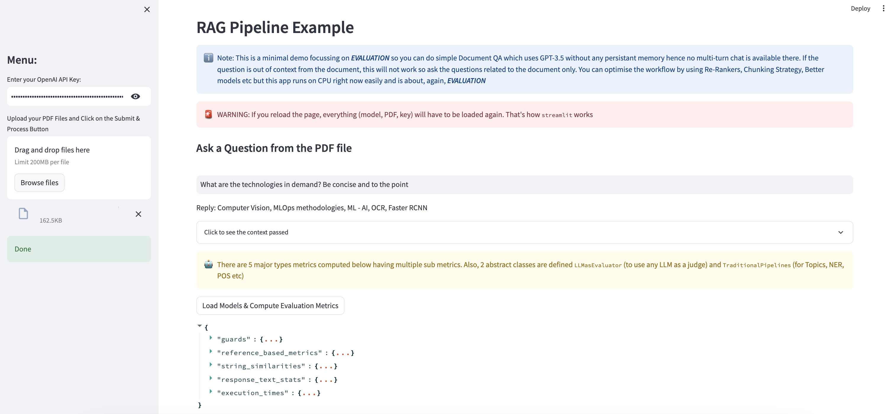

# End to End Evaluation Template for RAG Apps
This is a template and you add or remove metrics based on your usecases. Also there are `LLMasJudge` abstract classes which are useful to use [PHUDGE](https://github.com/deshwalmahesh/PHUDGE/) and GPT4 type of LLMs as evaluator. For more details to understand the evaluations, look inside `SEE_THIS.ipynb`




# How to use
Tested with: `Python 3.9`

Step: 
1. `pip install -r requirements.txt`
2. `pip install -U evaluate` (without it, some old metrics won't work)
3. `streamlit run eval_rag_app.py`

# List of Current Metrics
You can extend these even more but the current ones are:
```
{'guards': {'query_injection': [{'label': 'SAFE',
    'score': 0.9999986886978149}],
  'context_injection': [{'label': 'SAFE', 'score': 0.9999991655349731}],
  'query_bias': [{'label': 'Biased', 'score': 0.6330747604370117}],
  'context_bias': [{'label': 'Non-biased', 'score': 0.5858706831932068}],
  'response_bias': [{'label': 'Biased', 'score': 0.5588837265968323}],
  'query_regex': {},
  'context_regex': {},
  'response_regex': {},
  'query_toxicity': [{'label': 'toxic', 'score': 0.9225953817367554}],
  'context_toxicity': [{'label': 'toxic', 'score': 0.9640267491340637}],
  'response_toxicity': [{'label': 'non-toxic', 'score': 0.9988303780555725}],
  'query_sentiment': {'neg': 0.701,
   'neu': 0.299,
   'pos': 0.0,
   'compound': -0.6908},
  'query_polarity': [{'negative': 0.98,
    'other': 0.01,
    'neutral': 0.01,
    'positive': 0.0}],
  'context_polarity': [{'negative': 0.96,
    'other': 0.03,
    'neutral': 0.01,
    'positive': 0.0}],
  'response_polarity': [{'negative': 0.7,
    'other': 0.19,
    'neutral': 0.1,
    'positive': 0.02}],
  'query_response_hallucination': {'entailment': 1.5,
   'neutral': 97.8,
   'contradiction': 0.7},
  'context_response_hallucination': {'entailment': 10.3,
   'neutral': 79.7,
   'contradiction': 10.0},
  'harmful_query': False,
  'harmful_context': False,
  'harmful_response': False,
  'refusal_response': False},
 'reference_based_metrics': {'query_response_bertscore': {'precision': [0.8446345925331116],
   'recall': [0.8695610761642456],
   'f1': [0.8569165468215942],
   'hashcode': 'roberta-large_L17_no-idf_version=0.3.12(hug_trans=4.41.0)'},
  'query_response_rouge': {'rouge1': [0.125],
   'rouge2': [0.0],
   'rougeL': [0.125],
   'rougeLsum': [0.125]},
  'query_response_bleu': {'bleu': 0.0,
   'precisions': [0.07692307692307693, 0.0, 0.0, 0.0],
   'brevity_penalty': 1.0,
   'length_ratio': 3.25,
   'translation_length': 13,
   'reference_length': 4},
  'query_response_bleurt': {'scores': [-1.2369751930236816]},
  'query_response_meteor': {'meteor': 0.10204081632653061},
  'context_response_bertscore': {'precision': [0.8416609168052673],
   'recall': [0.8466401696205139],
   'f1': [0.8441432118415833],
   'hashcode': 'roberta-large_L17_no-idf_version=0.3.12(hug_trans=4.41.0)'},
  'context_response_rouge': {'rouge1': [0.09523809523809525],
   'rouge2': [0.0],
   'rougeL': [0.09523809523809525],
   'rougeLsum': [0.09523809523809525]},
  'context_response_bleu': {'bleu': 0.0,
   'precisions': [0.07692307692307693, 0.0, 0.0, 0.0],
   'brevity_penalty': 1.0,
   'length_ratio': 1.625,
   'translation_length': 13,
   'reference_length': 8},
  'context_response_bleurt': {'scores': [-1.3652904033660889]},
  'context_response_meteor': {'meteor': 0.05319148936170213}},
 'string_similarities': {'query_response_fuzz_q_ratio': 33,
  'query_response_fuzz_partial_ratio': 52,
  'query_response_fuzz_partial_token_set_ratio': 100,
  'query_response_fuzz_partial_token_sort_ratio': 52,
  'query_response_fuzz_token_set_ratio': 38,
  'query_response_fuzz_token_sort_ratio': 38,
  'query_response_levenshtein_distance': 49,
  'query_response_bm_25_scores': array([-0.27465307]),
  'context_response_fuzz_q_ratio': 40,
  'context_response_fuzz_partial_ratio': 40,
  'context_response_fuzz_partial_token_set_ratio': 100,
  'context_response_fuzz_partial_token_sort_ratio': 50,
  'context_response_fuzz_token_set_ratio': 42,
  'context_response_fuzz_token_sort_ratio': 42,
  'context_response_levenshtein_distance': 47,
  'context_response_bm_25_scores': array([-0.27465307])},
 'response_text_stats': {'result_flesch_reading_ease': 90.77,
  'result_flesch_kincaid_grade': 2.1,
  'result_smog_index': 0.0,
  'result_coleman_liau_index': 3.82,
  'result_automated_readability_index': 2.0,
  'result_dale_chall_readability_score': 6.57,
  'result_difficult_words': 2,
  'result_linsear_write_formula': 2.0,
  'result_gunning_fog': 2.4,
  'result_text_standard': '1st and 2nd grade',
  'result_fernandez_huerta': 122.72,
  'result_szigriszt_pazos': 122.96,
  'result_gutierrez_polini': 51.88,
  'result_crawford': -0.8,
  'result_gulpease_index': 95.7,
  'result_osman': 89.92}}
```
