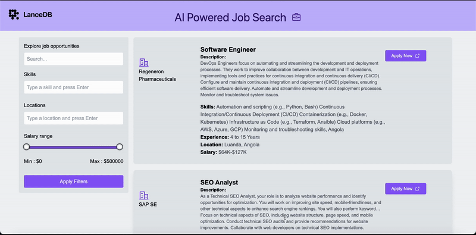

**AI Powered Job Search**
======================================================

An **AI-powered job search** application delivering unmatched speed, accuracy, and relevance in job recommendations. This platform uses **LanceDB** as vector database for efficient semantic search, **React.js** for a seamless user interface, **Node.js** for robust backend services, and **LangChain.js** for natural language understanding. It processes and retrieves job listings using advanced filtering mechanisms, ensuring precise and accurate results as per to user's filters.

* * *

**Demo**
--------



* * *


**Unmatched Features**
----------------------

-   **🔍 Intelligent Job Discovery**: Input job titles, skills, or locations to receive precise, tailored job listings instantly.

-   **🌐 Scalable Dataset Processing**: Handles massive datasets of job postings, ensuring efficient and reliable search results.

-   **📈 Precision Matching Technology**: Leverages **semantic similarity** through advanced embeddings to align user queries with the most relevant job listings.

-   **🧠 AI-Powered Insights**: Built with **LangChain.js** for sophisticated natural language understanding and a **vector database** for high-speed similarity searches.

-   **🔄 Dynamic Data Customization**: Replace or augment the default dataset to target specific industries, locations, or roles seamlessly.

-   **⚙️ Advanced Filtering**: Filters results based on parameters like location, job type, and skills to deliver hyper-relevant outcomes.

* * * * *

**How It Works**
----------------

1.  **Data Preprocessing**: Job postings are divided into smaller, searchable chunks using **RecursiveCharacterTextSplitter**, ensuring no context is lost.

2.  **Vector Embedding**: Preprocessed chunks are embedded using **OpenAIEmbeddings**, allowing for semantic understanding of job descriptions and queries.

3.  **Efficient Storage**: Embedded vectors are stored in **LanceDB**, optimized for rapid and scalable similarity searches.

4.  **Advanced Filtering and Retrieval**: User inputs and filtering criteria are matched against the dataset, delivering the **top most relevant job postings** within milliseconds.

* * * * *

**Technical Highlights**
------------------------

-   **Advanced Search Architecture**: Combines **React.js** for a seamless UI and **Node.js** for robust backend support.

-   **High-Speed Vector Database**: Utilizes **LanceDB** for efficient storage and similarity searches.

-   **Sophisticated NLP Capabilities**: Powered by **LangChain.js**, enabling deep understanding of user queries and job descriptions.

-   **Customizable and Scalable**: Modify datasets easily to adapt to different industries, markets, or user requirements.

-   **Filtering for Precision**: Supports advanced filtering by salary, location, job type, and more for highly accurate results.

* * * * *

**Applications and Use Cases**
------------------------------

-   **Job Seekers**: Discover opportunities aligned with skills and aspirations effortlessly.

-   **Recruiters**: Streamline candidate recommendations and job matching processes.

-   **Career Platforms**: Enhance user engagement with personalized job suggestions.

-   **Custom Job Boards**: Cater to niche markets with industry-specific datasets.

* * * * *

**Getting Started**
-------------------

### **1\. Prerequisites**

-   **Node.js** version **20+**

-   A valid [OpenAI API Key](https://platform.openai.com/signup)

### **2\. Installation**

Clone the repository and install dependencies:

```
git clone <repository-url>
cd <repository-folder>
npm install
```

### **3\. Configure API Key**

Add your OpenAI API key in `.env` or direclty export from you terminal for quick testing:

```
OPENAI_API_KEY=your_openai_key
```


### **4\. Customizing the Dataset**
---------------------------

Replace or augment the job posting dataset for tailored results:

1.  Navigate to `src/Backend/dataSourceFiles`.

2.  Replace the existing `.csv` file with your custom dataset.

3.  Restart the backend server to apply the changes.

For example, utilize the **Jobs Dataset** from Kaggle: Jobs Dataset on Kaggle [Jobs posting dataset](https://www.kaggle.com/datasets/ravindrasinghrana/job-description-dataset)

* * * * *

### **5\. Running the Application**

Add your data file 

#### Run Backend Server:

```
npm run server
```

#### Run client Application:

```
npm run dev
```

#### Run full Application:

npm start

Access the app at:

```
http://localhost:5173
```

* * * * *

**Future Enhancements**
-----------------------

*   Support for additional file formats (e.g., `.csv`, `.json`).
*   Deployment to cloud platforms (e.g., Vercel, AWS).
*   Multi-Modal Search: Incorporate support for resumes, cover letters, and multimedia job descriptions.
*   Enhanced Filtering Options: Add filters for salary, company size, and job type.

* * *

Feel free to fork, contribute, and customize the project to suit your needs! 🎉
