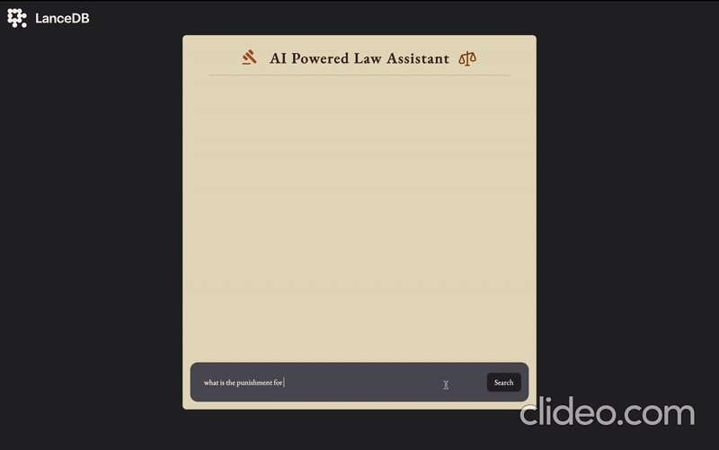
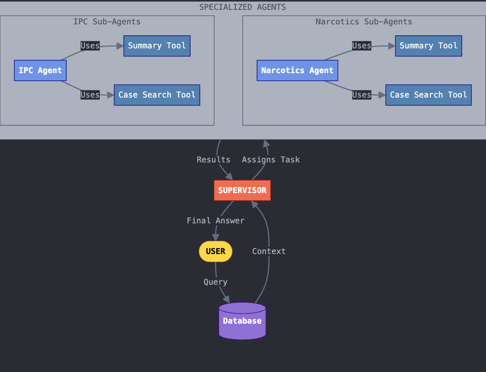

AI-Powered Law Assistant
========================

📜 Description
--------------

The AI-Powered Law Assistant is a **Hierarchical multi-agent** system designed to assist legal professionals, law students, and researchers by retrieving, analyzing, and summarizing legal information. It leverages **LangGraph**, **LangChain**, and **LanceDB** to efficiently process queries related to the Indian Penal Code (IPC) and the NDPS Act (Narcotics & Drugs).

 The system follows a top-down agent structure, where a Supervisor Agent directs queries to specialized agents, such as the IPC Agent and Narcotics Agent, each responsible for legal interpretation and case retrieval. Sub-agents further enhance processing by fetching relevant case laws and generating structured legal summaries. LanceDB acts as the vector database for fast legal document retrieval, ensuring context-aware and precise responses.

**Demo**

--------

### 🧠 **Concept & Architecture**

The system is structured as a **hierarchical multi-agent framework**, where different agents perform specialized tasks:

#### **1\. Supervising Agent**

-   Acts as the main controller.

-   Processes Natural Language (NL) user queries.

-   Directs the query to the appropriate legal agent based on context.

#### **2\. Primary Agents**

Each primary agent handles a specific category of legal queries.

-   **IPC Agent**: Handles queries related to the **Indian Penal Code (IPC)**.

-   **Narcotics Agent**: Manages cases related to **narcotics & drugs laws**.

#### **3\. Sub-Agents under Each Primary Agent**

Each primary agent is further divided into two specialized sub-agents:

-   **Retrieve Relevant Cases Sub-Agent**: Fetches relevant cases based on embeddings stored in **LanceDB**.

-   **Analysis & Summary Sub-Agent**: Analyzes retrieved legal cases and provides a concise summary.

⭐ Key Features
--------------

✅ **Intelligent Query Processing** -- Understands legal queries and directs them to relevant agents.\
✅ **Efficient Legal Case Retrieval** -- Uses **LanceDB embeddings** for fast & accurate case retrieval.\
✅ **Hierarchical Multi-Agent System** -- Modular agents performing specific roles.\
✅ **Context-Aware Summarization** -- Provides concise legal insights using AI-driven text analysis.\
✅ **Scalable & Modular** -- Easily extendable with additional legal domains or functionalities.

⚙️ How It Works
---------------

1.  **User submits a legal query** (e.g., "What does Section 420 IPC state?").

2.  **Supervising Agent processes** the query and determines which legal agent to assign it to.

3.  The **relevant agent retrieves** legal cases using **LanceDB embeddings**.

4.  The **sub-agents analyze and summarize** the information.

5.  The **response is returned** in a structured, easy-to-understand format.

🚀 Getting Started
------------------

### **Prerequisites**

Ensure you have the following installed on your system:

-   Node.js (v16+ recommended)

-   npm or yarn

### **Installation & Setup**

# Clone the repository

**Data Sources**: 

[IPC Sections](https://www.ncib.in/pdf/indian-penal-code.pdf) &  [Narcotics & Drugs PDFs](https://www.indiacode.nic.in/bitstream/123456789/18974/1/narcotic-drugs-and-psychotropic-substances-act-1985.pdf)
  Paste the data source under server > data 

# Install dependencies
add you openAI key in env file and then do
npm install version 22

npm run server(server only)

npm run dev(client only)

npm start(full project)

🔥 Future Enhancements
----------------------

-   **Interactive UI**: A user-friendly front-end built with React.

-   **Voice-Based Query Support**: Accepting spoken legal queries.

-   **Case Law Expansion**: Adding more legal datasets for diverse jurisdictions.

-   **Chatbot Integration**: AI-powered legal chatbot for instant legal guidance.

-   **Multilingual Support**: Expanding to handle multiple languages.

🌍 Real-World Use Cases
-----------------------

🔹 **Law Firms & Legal Practitioners** -- Quick case law retrieval and analysis.\
🔹 **Law Students & Researchers** -- Efficient study and legal research tool.\
🔹 **Government & Judiciary** -- AI-assisted case analysis and legal compliance checks.\
🔹 **Citizens & NGOs** -- Legal rights awareness and quick legal advice.