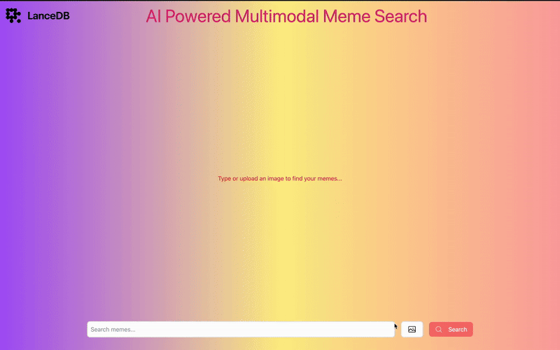

**AI-Powered Multimodal Meme Search**
=====================================

An advanced AI-powered **meme search engine** that allows users to find memes using **both text and image queries**. By leveraging **LanceDB** as a high-performance vector database and **Roboflow's CLIP model** for embedding generation, the platform delivers fast and accurate meme retrieval. The frontend is built using **React.js** and **Tailwind CSS**, ensuring a seamless and responsive user experience.

**Demo**
--------

* * *

**Key Features**
----------------

✅ **Multimodal Search** -- Search memes using either text descriptions or image queries.\
✅ **Vectorized Meme Database** -- Utilizes **LanceDB** to store and retrieve embeddings efficiently.\
✅ **Roboflow CLIP Model** -- Uses **CLIP embeddings** for high-accuracy semantic search.\
✅ **Optimized Frontend** -- Built with **React.js** and styled with **Tailwind CSS** for smooth user interactions.\
✅ **Instant Retrieval** -- Returns **top 25 most relevant** memes in real time.\
✅ **Fast & Scalable** -- Efficient storage and indexing enable rapid meme discovery.

* * * * *

**How It Works**
----------------

### **1\. Data Processing & Embeddings**

-   Meme images are **embedded** using the **Roboflow CLIP model**.
-   Text descriptions are **converted into vector embeddings** for similarity matching.
-   Both image and text embeddings are **stored in LanceDB**.

### **2\. Query Processing & Retrieval**

-   **Text Query:** Converts text input into a vector and searches the database.
-   **Image Query:** Converts an uploaded image into a vector and retrieves the closest matches.
-   The **top 25 results** are returned based on similarity scores.

### **3\. Display & User Interaction**

-   The frontend **renders the retrieved memes** in a responsive grid.
-   Users can **download memes** directly from the interface.

* * * * *

**Installation & Setup**
------------------------

### **1\. Prerequisites**

-   **Node.js v20+**
-   **NPM or Yarn**
-   **LanceDB installed locally**

### **2\. Clone Repository**

`git clone <repository-url>
cd multimodal-meme-search
npm install`

### **3\. Running the Application**

#### Start the Backend:

`npm run server`

#### Start the Frontend:

`npm run dev`

#### Start both together:
 
 `npm start`

#### Access the App:

`http://localhost:5173`

* * * * *

**Customizing the Meme Dataset**
--------------------------------

To add your own meme dataset:

1.  Place your meme images in the `src/server/dataset/images/` directory. [memes dataset](https://www.kaggle.com/datasets/hammadjavaid/6992-labeled-meme-images-dataset)
2.  place a labels.csv file under  `src/server/dataset/` directory.  [memes dataset](https://www.kaggle.com/datasets/hammadjavaid/6992-labeled-meme-images-dataset)
3.  Run the embedding script to update the database.
4.  Restart the server to apply changes.

* * * * *

**Future Enhancements**
-----------------------

🚀 **More Meme Sources** -- Add support for meme scraping from online sources.\
📸 **User-Generated Memes** -- Allow users to upload and tag memes.\
🔍 **Advanced Filters** -- Filter by meme categories, themes, or trends.\
🌐 **Deploy to Cloud** -- Deploy on **Vercel, AWS, or DigitalOcean** for global accessibility.
