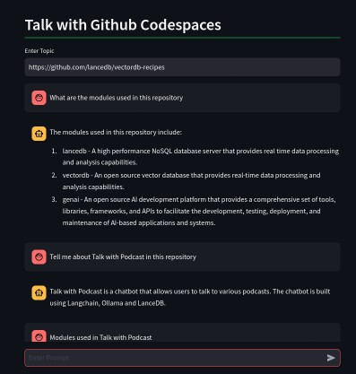

# Talk to Github CodeSpaces using Qwen1.5

Using this application, You can talk to Github Repositories. It will clone, embed all the Markdown, Python and Javascript files in the repository. This Application utilizes newly launched Qwen1.5 as a LLM.

---
**NOTE** <br>
For this application `OPENAI API KEY` is not required

---


1. Install Dependencies
```
pip install -r requirements.txt
```
2. Ollama Installation 
```
curl https://ollama.ai/install.sh | sh
ollama pull qwen
```
for Mac:
```
brew install qwen

```
On a separate terminal, run the following command:
```
ollama pull qwen
```

### Youtube Demo


You are ready to start

## Run Streamlit App

 Run Application
```
streamlit run app.py
```
