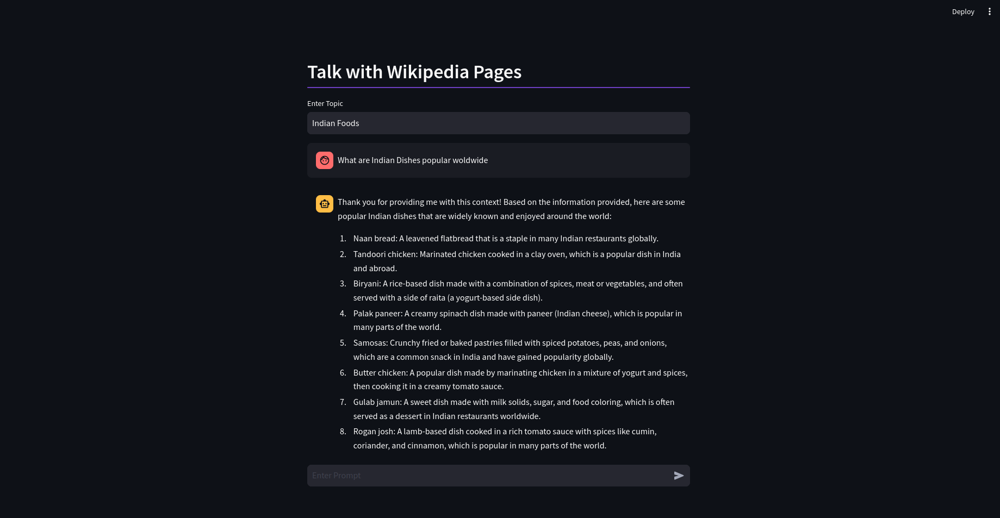

# Talk to Wikipedia Pages

Using this application, You can talk to Wikipedia Pages by giving topic. It will automatically extract relevant wikipedia pages and build a chatbot for you.

1. Install Dependencies
```
pip install -r requirements.txt
```
2. Ollama Installation 
```
curl https://ollama.ai/install.sh | sh
ollama pull llama2
```
for Mac:
```
brew install ollama

```
On a separate terminal, run the following command:
```
ollama pull llama2
```

### Youtube Demo

You are ready to start

## Run Streamlit App

- Run Application
```
OPENAI_API_KEY=sk-... streamlit run app.py
```

### Future Scope
1. Sources of Wikipedia Pages used for Chat
2. Chat History
3. Adding other platforms for building RAG otherthan Langchain