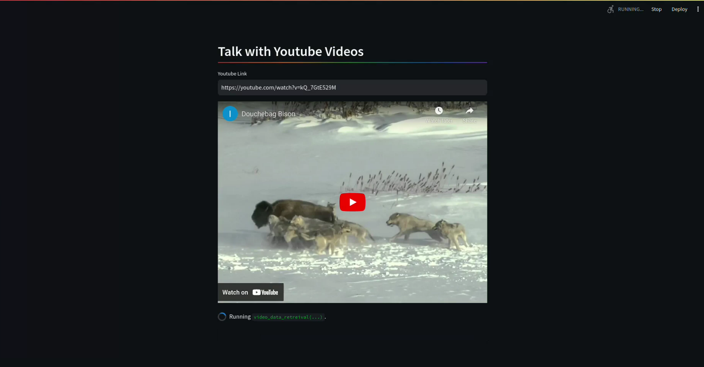

# Talk to Youtube Video using GPT4 Vision API

Using this application, You can talk to any Youtube Video using GPT4 Vision API.

[](demo_video/demo.mp4)

## Quickstart
- Change `OPENAPIKEY` in .env file
- Install dependencies 
```
pip install -r requirements.txt
```
- Run Application
```
streamlit run app.py
```
