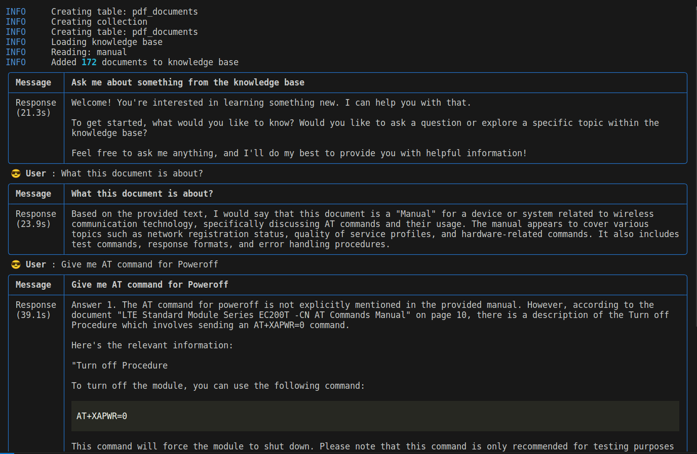

## CLI SDK Manual Chatbot Locally
This application is a CLI chatbot for SDK/Hardware documents that uses the Local RAG model with LLama3 with Ollama, LanceDB, Openhermes Embeddings. 

The chatbot is built using the RAG mode using Phidata Assistant and Knowledge Base.



### Steps to Run the Application

1. Install Dependencies
```
pip install -r requirements.txt
```

2. Setup Ollama

- Install Ollama on Linux
```
curl -fsSL https://ollama.com/install.sh | sh
```
- Install Ollama on Mac
```
brew install ollama
```

3. Run Llama3 and Openhermes with Ollama
```
ollama run llama3
ollama run openhermes
```

Now you are ready to run CLI SDK manual Chatbot locally
```
python3 assistant.py
```

*Note: This Chatbot utilizes `data/manual.pdf`. For running it on your document change path of document in `assistant.py`*


