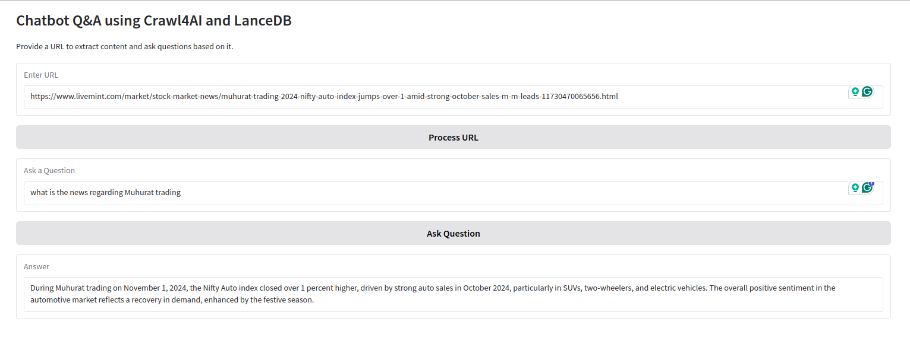

# Chatbot Q&A using Crawl4AI and LanceDB

An advanced Q&A tool for extracting and answering questions from any website URL using [Crawl4AI](https://github.com/yourusername/crawl4ai) for efficient text extraction and [LanceDB](https://github.com/yourusername/lancedb) for vector-based semantic search.

## 🚀 Features

- **Advanced Web Crawling with Crawl4AI**:  
  - Multi-browser support (Chromium, Firefox, WebKit)
  - Extraction of media tags, metadata, links, and page structure
  - Support for JSON, cleaned HTML, and Markdown output formats
  - Enhanced customization options: user-agent, headers, authentication, JavaScript execution, and more
  
- **Q&A Powered by LanceDB**:
  - Serverless, production-scale vector search for high-performance Q&A
  - Support for vectors, metadata, text, images, videos, and more
  - Zero-copy, versioning-friendly database with Python and JavaScript integration
  - Compatibility with LangChain, LlamaIndex, Apache-Arrow, Pandas, Polars, DuckDB, and more

1. **Set up Crawl4AI**: Configure Crawl4AI to handle the web crawling and data extraction from specified URLs.

2. **Configure LanceDB**: Use LanceDB to manage vector-based data for Q&A. Add URL-based extracted data as embeddings for question answering.

3. **Run the notebook**: Try it now in our Colab notebook:   
