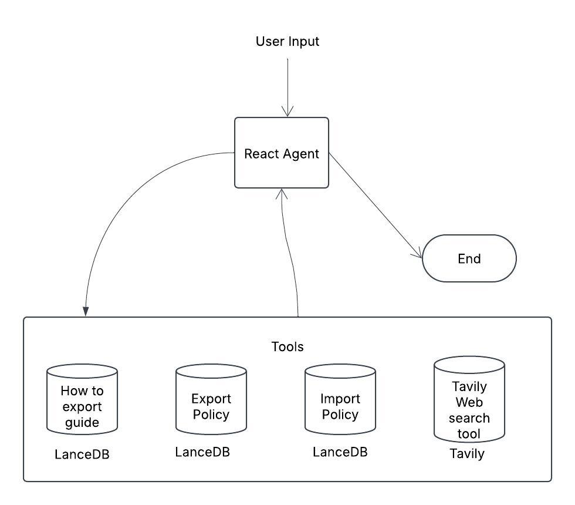

# **Multi-Source RAG Agent for Export/Import Guidance**

This project implements a **multi-source Retrieval Augmented Generation (RAG) agent** designed to assist users with **export and import guidance**. It integrates **LanceDB** for efficient document retrieval and **Tavily** for real-time external searches. The system helps users navigate **export/import policies, product classifications, compliance guidelines, and industry updates**.

## **Use Case**
Businesses and individuals involved in **international trade** often struggle to find relevant regulations, policies, and procedural guidelines. This agent provides an AI-powered solution to:
- Retrieve **export/import documentation** for different regions.
- Fetch **latest policy updates and HS codes**.
- Provide **real-time news and insights** to help with decision-making.
- Assist **logistics, trade consultants, and businesses** with compliance.

### **Who can use it?**
- **Exporters & Importers**: To check policies and trade regulations.
- **Trade Compliance Officers**: To stay updated with changing laws.
- **Supply Chain & Logistics Teams**: To streamline trade operations.
- **Government & Policy Analysts**: To analyze trade trends.

## **Features**
✔ **Multi-source Data Retrieval using [LanceDB](https://lancedb.com/)**  
✔ **Real-time Policy Updates & News using [Tavily](https://tavily.com/)**  
✔ **Memory & Streaming Management using [LangGraph](https://www.langchain.com/langgraph)**

## Colab Demo
For hands-on testing, check out the Google Colab notebook:

  

### Note

This template.You can use for multiple use cases. Feel free to try or let us know if you have any requirements.
