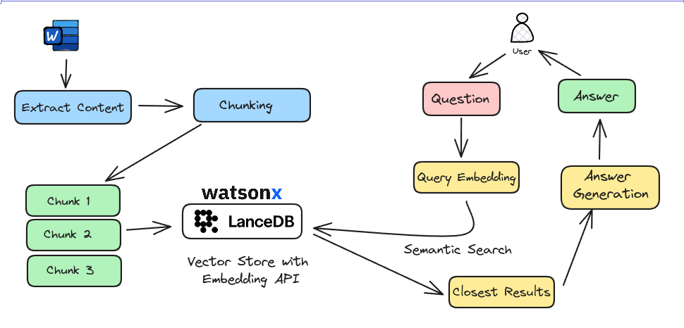

# Retrieval-Augmented Generation(RAG) with IBM Watsonx

In this notebook, we will build a Retrieval-Augmented Generation(RAG) using IBM Watsonx embeddings and GPT 3.5 LLM .

RAG is a technique that retrieves related documents to the user's question, combines them with LLM-base prompt, and sends them to LLMs like GPT to produce more factually accurate generation.

In this example, we'll use `DeadPool and Wolverine` marvel page to build RAG around it.

By the end of this example, we’ll have created a Retrieval-Augmented Generation (RAG) system for webpages. We showed how it works with pages about Deadpool and Wolverine from Marvel. Here’s how we did it in 4 simple steps:

1. Load data from the webpage.
2. Create a custom embedding function with IBM Watsonx.
3. Add the loaded documents into a table with their embeddings.
4. Use ChatChain to generate answers based on the retrieved documents.

