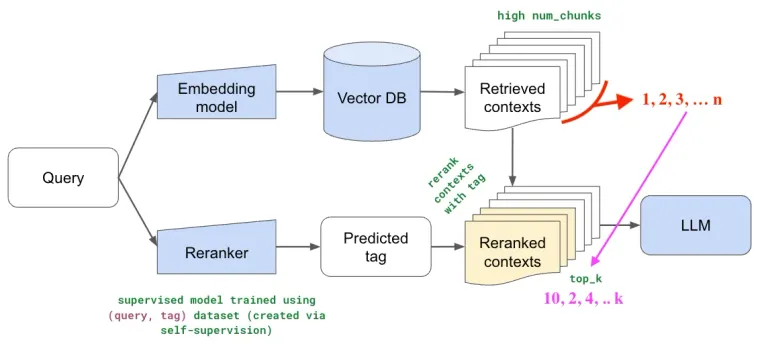

Re-ranking is the simplest. Idea is pretty simple.

1. You assume that Embedding + Search algo are not 100% precise so you use Recall to your advantage and get similar high `N` (say 25) number of related chunks from corpus.

2. Second step is to use a powerful model to increase the Precision. You re-rank above `N` queries again so that you can change the relative ordering and now select Top `K` queries (say 3) to pass as a context where `K` < `N` thus increasing the Precision.

Re-rank Search Results uses Reranker.

[Read Full Blog](https://blog.lancedb.com/simplest-method-to-improve-rag-pipeline-re-ranking-cf6eaec6d544/)