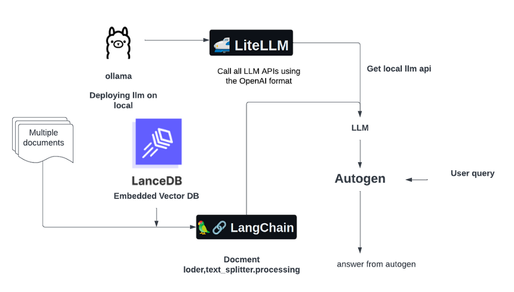

 

# Super Agent: Integrating Autogen Technologies and Vector Databases

## Overview

The Super Agent project showcases the integration of cutting-edge technologies including Ollama, LiteLLM, Autogen, LanceDB, and LangChain to create a powerful AI agent. This agent leverages the strengths of vector databases and conversational AI to provide sophisticated data management and context-aware interactions. The goal is to harness the capabilities of LanceDB's vector database and Autogen's conversational AI framework to build a Super Agent that excels in understanding and processing complex queries.

## Installation

For detailed installation instructions, please refer to our comprehensive guide available in the Google Colaboratory notebook:

 

This guide will walk you through setting up each component of the Super Agent, ensuring a seamless integration process.

## Building the Super Agent

### Setting Up Autogen

Autogen plays a pivotal role in developing sophisticated conversational AI agents. It enables the creation of dynamic agents capable of engaging in complex dialogues, significantly enhancing user interaction.

### Integrating LiteLLM and Ollama

- **LiteLLM**: Facilitates easy API connectivity with large language models, allowing for seamless integration and interaction.
- **Ollama**: Used for deploying large language models (LLMs) on a local system, Ollama ensures that the power of LLMs can be harnessed directly within your environment.

### Leveraging LangChain for Contextual Awareness

LangChain is instrumental in enhancing the Super Agent's ability to comprehend and act upon the context within user queries, providing more accurate and relevant responses.

### Utilizing LanceDB for Efficient Data Management

LanceDB is a vector database that excels in managing and querying large datasets efficiently, making it an essential component for the Super Agent. It allows for quick and precise searches, facilitating better data access and manipulation.

## Implementation Steps

The Super Agent's implementation involves several key steps:

1. **Vector Store Creation**: Index the target PDF with LanceDB to create a searchable vector store.
2. **LangChain Setup**: Implement a Question-Answer (QA) chain with LangChain to enable context-aware querying.
3. **Autogen Agents Integration**: Configure user and assistant agents using Autogen for interactive and dynamic querying.

## Resources

- **Google Colab**: For hands-on examples and detailed code snippets for implementing the Super Agent, visit our [Google Colab Notebook](https://colab.research.google.com/github/lancedb/vectordb-recipes/blob/main/examples/SuperAgent_Autogen/main.ipynb).

- **Blog Post**: For a more in-depth exploration of the concepts and methodologies discussed in this project, please visit our [Blog Post](https://blog.lancedb.com/optimizing-ai-agents-harnessing-openai-compatible-technologies-and-vector-databases/).

