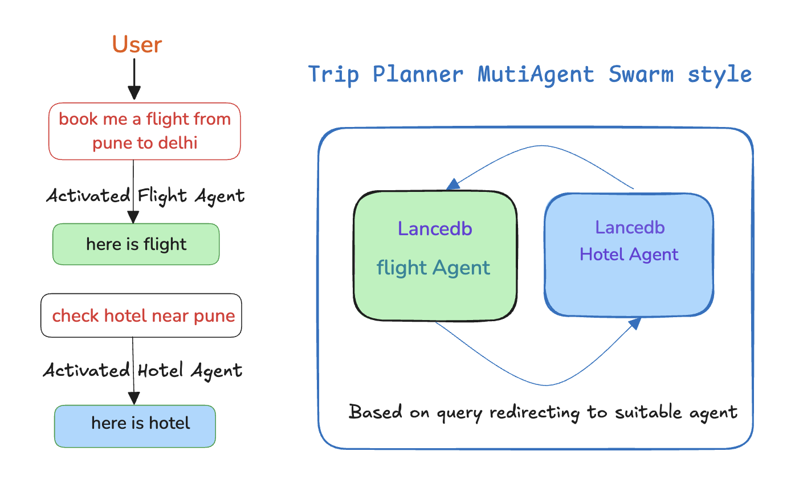

# 🌍 Swarm Style Trip Planner Agent

A sophisticated travel planning assistant powered by multi-agent collaboration and vector search capabilities. This project demonstrates the power of specialized AI agents working together to provide comprehensive travel planning assistance.

## ✨ Key Features

- 🚀 **Multi-Agent Collaboration** – Specialized agents work together, seamlessly passing context to one another
- 🔧 **Customizable Handoff Tools** – Built-in mechanisms for smooth communication between agents
- 📂 **LanceDB for Data Retrieval** – High-performance vector search and full-text search for accurate and fast information retrieval
- 🌍 **Travel Agent Use Case** – Agents collaborate to handle different aspects of travel planning, ensuring efficient and context-aware responses

## 💡 How It Works

The Swarm Style Travel Planner uses a sophisticated multi-agent system where different specialized agents handle various aspects of travel planning:

1. **Flight Search Agent**: Handles flight-related queries and searches
2. **Hotel Search Agent**: Manages hotel and accommodation searches
3. **Coordination Agent**: Orchestrates communication between agents and maintains context

The system uses LanceDB for efficient vector search capabilities, allowing for semantic understanding of user queries and fast retrieval of relevant travel information.

## 🎯 Usage

1. Launch the application using `streamlit run app.py`
2. Enter your travel-related query in the chat interface
3. The system will automatically:
   - Parse your requirements
   - Route queries to appropriate specialized agents
   - Provide comprehensive travel suggestions
   - Maintain context throughout the conversation

Example queries:
- "Find me flights from New York to London next month"
- "I need a hotel in Paris near the Eiffel Tower"
- "Plan a week-long trip to Tokyo with flights and hotels"

## 🧪 Try in Google Colab

Experience the Swarm Style Travel Planner directly on Google Colab:

