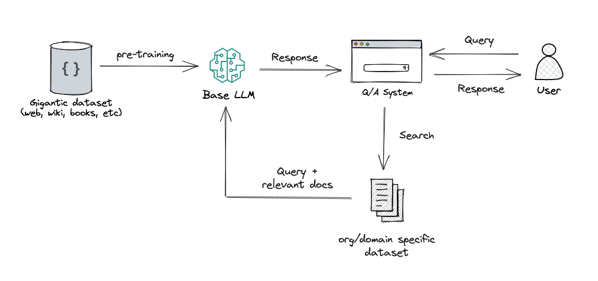
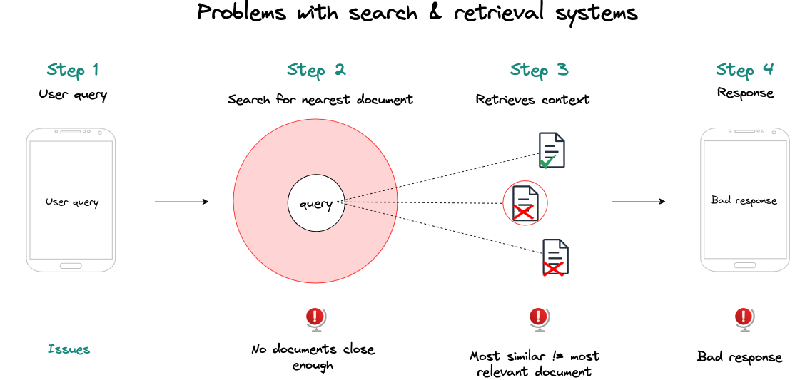
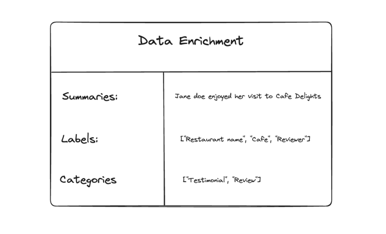
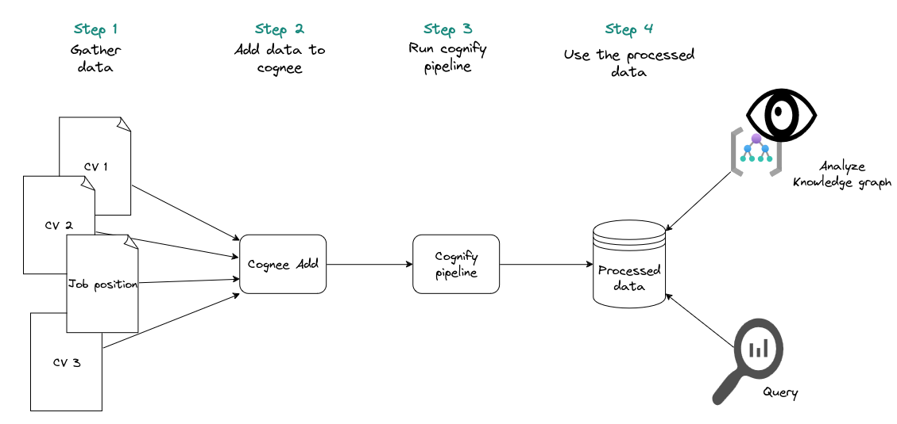

# Cognee - Get Started

## Let's talk about the problem first

### Large Language Models (LLMs) have become powerful tools for generating text and answering questions, but they still have several limitations and challenges. Below is an overview of some of the biggest problems with the results they produce:

### 1. Hallucinations and Misinformation
- Hallucinations: LLMs sometimes produce outputs that are factually incorrect or entirely fabricated. This phenomenon is known as "hallucination." Even if an LLM seems confident, the information it provides might not be reliable.
- Misinformation: Misinformation can be subtle or glaring, ranging from minor inaccuracies to entirely fictitious events, sources, or data.

### 2. Lack of Contextual Understanding
- LLMs can recognize and replicate patterns in language but don’t have true comprehension. This can lead to responses that are coherent but miss nuanced context or deeper meaning.
- They can misinterpret multi-turn conversations, leading to confusion in maintaining context over a long dialogue.

### 3. Inconsistent Reliability
- Depending on the prompt, LLMs might produce inconsistent responses to similar questions or tasks. For example, the same query might result in conflicting answers when asked in slightly different ways.
- This inconsistency can undermine trust in the model's outputs, especially in professional or academic settings.

### 4. Inability to Access Real-Time Information
- Most LLMs are trained on data up to a specific point and cannot access or generate information on current events or emerging trends unless updated. This can make them unsuitable for inquiries requiring up-to-date information.
- Real-time browsing capabilities can help, but they are not universally available.

### 5. Lack of Personalization and Adaptability
- LLMs do not naturally adapt to individual preferences or learning styles unless explicitly programmed to do so. This limits their usefulness in providing personalized recommendations or support.

### 6. Difficulty with Highly Technical or Niche Domains
- LLMs may struggle with highly specialized or technical topics where domain-specific knowledge is required.
- They can produce technically plausible but inaccurate or incomplete information, which can be misleading in areas like law, medicine, or scientific research.

### 7. Ambiguity in Response Generation
- LLMs might not always specify their level of certainty, making it hard to gauge when they are speculating or providing less confident answers.
- They lack a mechanism to say “I don’t know,” which can lead to responses that are less useful or potentially misleading.

## The next solution was RAGs

RAGs (Retrieval Augmented Generation) are systems that connect to a vector store and search for similar data so they can enrich LLM response.

The problem lies in the nature of the search. If you just find some keywords, and return one or many documents from vectorstore this way, you will have an issue with the the way you would use to organise and prioritise documents.

## Semantic similarity search is not magic
The most similar result isn't the most relevant one.
If you search for documents in which the sentiment expressed is "I like apples.", one of the closest results you get are documents in which the sentiment expressed is "I don't like apples."
Wouldn't it be nice to have a semantic model LLMs could use?

## That is where Cognee comes in
Cognee assists developers in introducing greater predictability and management into their Retrieval-Augmented Generation (RAG) workflows through the use of graph architectures, vector stores, and auto-optimizing pipelines. Displaying information as a graph is the clearest way to grasp the content of your documents. Crucially, graphs allow systematic navigation and extraction of data from documents based on their hierarchy.

Cognee lets you create tasks and contextual pipelines of tasks that enable composable GraphRAG, where you have full control of all the elements of the pipeline from ingestion until graph creation.

## Core Concepts
Most of the data we provide to a system can be categorized as unstructured, semi-structured, or structured. Rows from a database would belong to structured data, jsons to semi-structured data, and logs that we input into the system could be considered unstructured. To organize and process this data, we need to ensure we have custom loaders for all data types, which can help us unify and organize it properly.

In the example above, we have a pipeline in which data has been imported from various sources, normalized, and stored in a database.

## Concept 2: Data Enrichment with LLMs
LLMs are adept at processing unstructured data. They can easily extract summaries, keywords, and other useful information from documents. We use function calling with Pydantic models to extract information from the unstructured data.

## Concept 3: Graphs
Knowledge graphs simply map out knowledge, linking specific facts and their connections. When Large Language Models (LLMs) process text, they infer these links, leading to occasional inaccuracies due to their probabilistic nature. Clearly defined relationships enhance their accuracy. This structured approach can extend beyond concepts to document layouts, pages, or other organizational schemas.

## Concept 4: Vector and Graph Retrieval
Cognee lets you use multiple vector and graph retrieval methods to find the most relevant information.

## Concept 5: Auto-Optimizing Pipelines
Integrating knowledge graphs into Retrieval-Augmented Generation (RAG) pipelines leads to an intriguing outcome: the system's adeptness at contextual understanding allows it to be evaluated in a way Machine Learning (ML) engineers are accustomed to. This involves bombarding the RAG system with hundreds of synthetic questions, enabling the knowledge graph to evolve and refine its context autonomously over time. This method paves the way for developing self-improving memory engines that can adapt to new data and user feedback.

## Below is a diagram of the cognee process for the data used in this example

