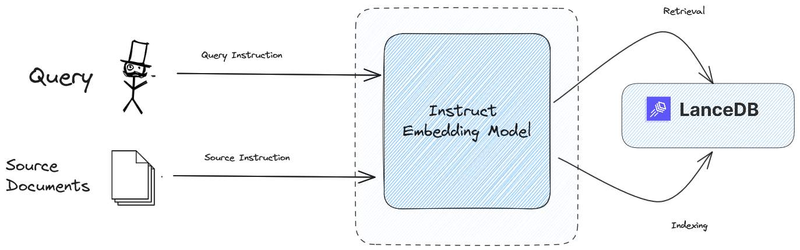

<a href="https://colab.research.google.com/github/lancedb/vectordb-recipes/blob/main/examples/instruct-multitask/main.ipynb"></a>

# Multitask Embedding with LanceDB
\
We are integrating the Instruct Embedding Model to our embedding API which will reduce redundant code structure and overhead. \
Find more about the Instruct Multitask Model [here](https://instructor-embedding.github.io/).


## Practical Applications

- **Search:** Evaluate the similarity between a query and a document in your database.
- **Spam Filtering:** Assess the proximity of an email to established examples of spam.
- **Content Moderation:** Measure the closeness of a social media message to recognized instances of abuse.
- **Conversational Agent:** Identify the closest examples of known intents to the user's messages.


## Using Colab

<a href="https://colab.research.google.com/github/lancedb/vectordb-recipes/blob/main/examples/instruct-multitask/main.ipynb"></a>

## Using Python file
### Install Requirements

```bash
pip install -r requirements.txt
```

### Run
```
python3 main.py
```
