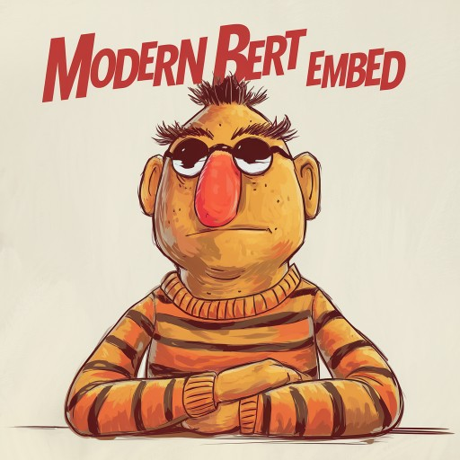
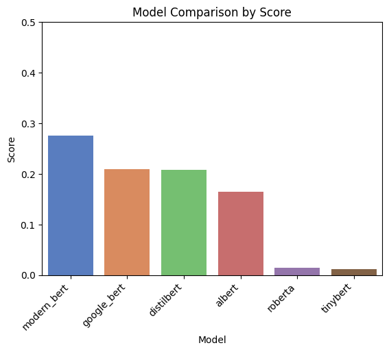

# Comparing ModernBERT with series of Bert Models

Comparing ModernBert with several established BERT-based models, such as Google's BERT, ALBERT, and RoBERTa, using the [Uber10K dataset](https://llamahub.ai/l/llama_datasets/Uber%2010K%20Dataset%202021), which contains question-answer pairs. OpenAI embeddings are used to represent the questions and answers, allowing us to assess the performance of ModernBert embeddings against OpenAI’s. The comparison focuses on key tasks like question answering and semantic understanding, evaluating accuracy, efficiency, and overall performance.

**The goal is to highlight the strengths and weaknesses of ModernBert in comparison to these well-known models.**

ModernBERT Embed is an embedding model trained from ModernBERT-base, bringing the new advances of ModernBERT to embeddings!

Trained on the Nomic Embed weakly-supervised and supervised datasets, modernbert-embed also supports Matryoshka Representation Learning dimensions of 256, reducing memory by 3x with minimal performance loss.

## Results
Comparing Uber10K dataset which is prepared using OpenAI Embeddings, and comparing it with Modernbert embeddings and other respected Bert series embedding model shows us the difference between retrieval power of each of the model.

This graph clearly shows that ModernBert clearly outperforms its respective Bert series models. But this retrival comparison is with OpenAI embedding and on Uber-10K dataset.

**Note**: Try it on different datasets, and results may vary on other datasets depending upon how dataset is prepared.