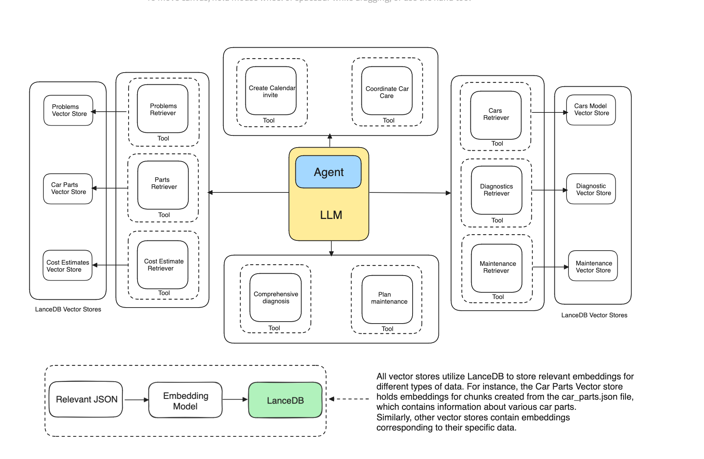

# Multidocument Agentic RAG



This example provides a comprehensive guide on creating a Multi-Document Agentic RAG leveraging the power of Embeddings and VectorDB. We'll explore how we can use Reasoning + Acting (ReAct) strategy to harness our RAG setup and make it more intelligent using different tools.

Colab walkthrough - <a href="https://colab.research.google.com/github/lancedb/vectordb-recipes/blob/main/examples/Multidocument-Agentic-RAG/main.ipynb"></a> 

[Read the Blog Post](https://blog.lancedb.com/multi-document-agentic-rag/)

### Python
Run the script
```python
python3 -m venv env
source env/bin/activate
pip3 install -r requirements.txt
cd examples/multi-document-agentic-rag
python3 main.py
```