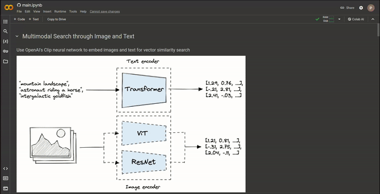

# Multimodal Search through Image and Text
This example is aimed to guide you through using OpenAI's Clip model to embed a dataset, store it into LanceDB, and search for relevant texts/images.



Colab walkthrough - <a href="https://colab.research.google.com/github/lancedb/vectordb-recipes/blob/main/examples/multimodal_search/main.ipynb"></a>

### Get dataset
The [animals dataset](https://huggingface.co/datasets/CVdatasets/ImageNet15_animals_unbalanced_aug1) can be loaded through HuggingFace within the code.

### Python
Run the script

```python
python main.py
```