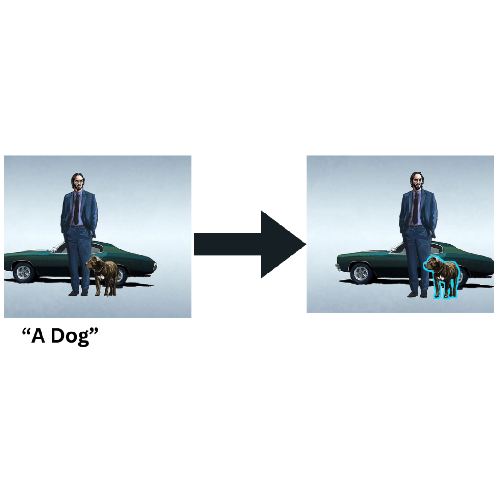
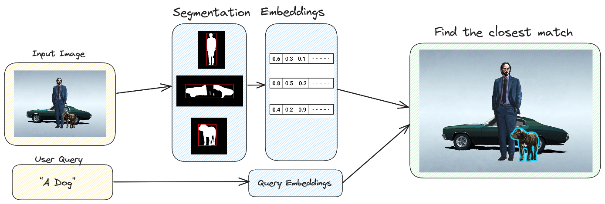

# 🔍Search engine using SAM & CLIP

  

###   🚀Create a Search Engine within an Image use **SAM**(Segment Anything) and **CLIP** (Constrastive Language Image Pretraining) model.
Follow the Colab Notebook for full code.

## Interface 🌟

1. Load the model.
2. Create the Segmentation mask of any Image.
3. Get the Embeddings of each extracted Segmentation masks as an seperate image.
4. Embed the User Query.
5. Index the Image embeddings into **LanceDB**.
6. Use Search method to find the closest match of Image Embedding (particular Segmentation Mask) and User Query.
7. Output the Highlighted closest object present.

 Read the Full [blog post](https://blog.lancedb.com/search-within-an-image-331b54e4285e)
