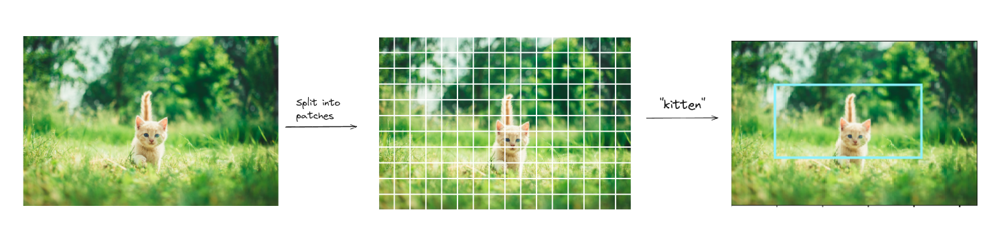

# Zero Shot Object Localization and Detection with OpenAI's CLIP

 

In this tutorial, we'll perform object detection on images using CLIP obtained from vector search. It will consist of 2 steps
User should put name of an object in query then
1. Vector Search will be performed to get images
2. Most similar image will be utilized to detect query object

### Dataset used:

Dataset used for this example is from [Huggingface](https://huggingface.co/datasets/jamescalam/image-text-demo). This dataset includes Images and their captions and dataset is embedded using CLIP.

Note: User can change dataset as per their usage/example.

### Details about Object Detection using CLIP

For performing Object Detection it follow same steps as YOLO. Here are the steps listed to detect any object.
1. Splitting image into patches
2. Parsing Patches with a window size of 4 and stride 1 with CLIP
3. Once all the patches are parsed and analysed by CLIP, next step is to calculate Xmin, Ymin, Xmax, and Ymax.
4. Plotting Bbox on image

