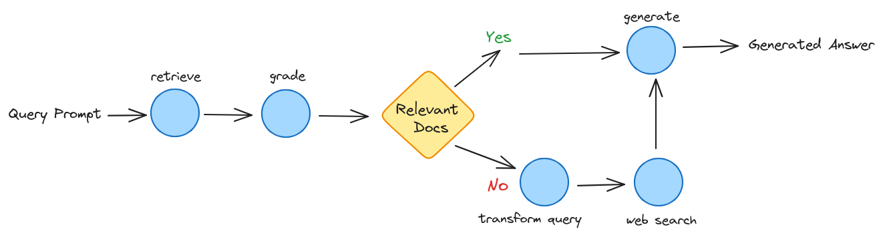

## Corrective RAG with Langgraph

Self-reflection can enhance RAG, enabling correction of poor quality retrieval or generations.

**Corrective Retrieval-Augmented Generation (CRAG)** is a method that works like a built-in fact-checker.

It adds both creativity and accuracy by creating text and then checking for any mistakes or made-up information. This helps make sure the final result is reliable and matches real-world facts. It's like a safety feature for AI writers, making their work more trustworthy and lowering the chances of spreading false information.

Corrective-RAG (CRAG) is a recent [paper]((https://arxiv.org/pdf/2401.15884.pdf)) that talks about a cool way to make a self-reflective RAG.

The method givesating/scores retrieved documents based on how well they answer a question:

For Correct documents -

1. If at least one document is really relevant, it moves on to creating text
2. Before creating text, it cleans up the knowledge
3. This breaks down the document into "knowledge strips"
4. It rates each strip and gets rid of ones that don't matter

For Ambiguous or Incorrect documents -
1. If all documents are not relevant enough or if it's not sure, the method looks for more information
2. It uses a web search to add more details to what it found
3. The diagram in the paper also show that they might change the question to get better results.