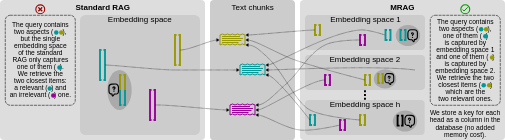

## Multi-Head RAG from Scratch

This  example demonstrates **Multi-Head RAG built from scratch** without using any supporting framework like Langchain and LlamaIndex. 


Multi-Head RAG concept came into picture from following paper.

Paper - https://arxiv.org/pdf/2406.05085

Multi-Head RAG (MRAG) is designed for queries needing multiple diverse documents. This approach improves retrieval accuracy for complex queries.



Steps:
1. Reading Document and Recursive Text Splitting
2. Setup 3 Embedding spaces schema with LanceDB Embedding API
3. Insert Chunks into all 3 Embedding spaces
4. Semantic search all the Embedding Spaces with Query question and collect the context.
5. Use collected context to generate answers.

This example utilizes OPENAI's `text-embedding-ada-002`, `llama3`, and `mistral` default models are used to create embedding spaces.

### Installation

Install all the dependencies
```
pip install -r requirements.txt
```

Install Ollama
```
curl -fsSL https://ollama.com/install.sh | sh
```

### Download models 
```
ollama pull llama3
ollama pull mistral
```

### Set OPENAI key as env 

```
export OPENAI_API_KEY=sk-...
```

### Run RAG
```
python3 main.py
```

**CAUTION:** MRAG takes lot of time to create all 3 Embedding spaces and query also because of working with 3 Embedding space requires converting text into embeddings three times with increases throughput time 3 times.