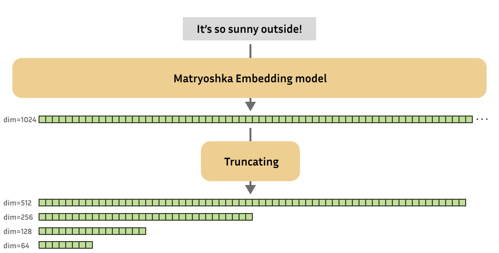
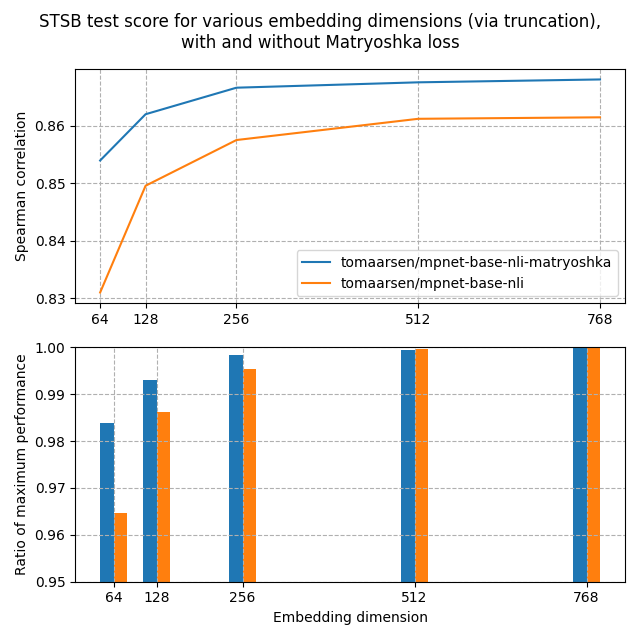

## Build RAG with Matryoshka Embeddings and LlamaIndex

Lets Split RAG Pipeline into 5 parts:

1. Data Loading from URL
2. Chunking and convert them in Matryoshka Embeddings of different sizes
3. LanceDB as Vector Store to these Embeddings
4. Query Engine
5. Answer Generation using Query Engine

RAG is a technique that retrieves related documents to the user's question, combines them with LLM-base prompt, and sends them to LLMs like GPT to produce more factually accurate generation.

### Matryoshka Embeddings

As research progressed, new state-of-the-art text **embedding models began producing embeddings with increasingly higher output dimensions**. While this enhances performance, it also reduces the efficiency of downstream tasks such as search or classification due to the larger number of values representing each input text.

*Image Source: HuggingFace*

These Matryoshka embedding models are designed so that even small, truncated embeddings remain useful. In short, Matryoshka embedding models can generate effective embeddings of various dimensions.

Both following models were trained on the AllNLI dataset, a combination of the SNLI and MultiNLI datasets. I evaluated these models on the STSBenchmark test set using multiple embedding dimensions. The results are illustrated in the following figure:

**Results:**

1. **Top Figure:** The Matryoshka model consistently achieves a higher Spearman similarity than the standard model across all dimensions, indicating its superiority in this task.

2. **Second Figure:** The Matryoshka model's performance declines much less rapidly than the standard model's. Even at just 8.3% of the full embedding size, the Matryoshka model retains 98.37% of its performance, compared to 96.46% for the standard model.

These findings suggest that truncating embeddings with a Matryoshka model can significantly:
1. Speed up downstream tasks such as retrieval.
2. Save on storage space.

All of this is achieved without a notable performance loss.